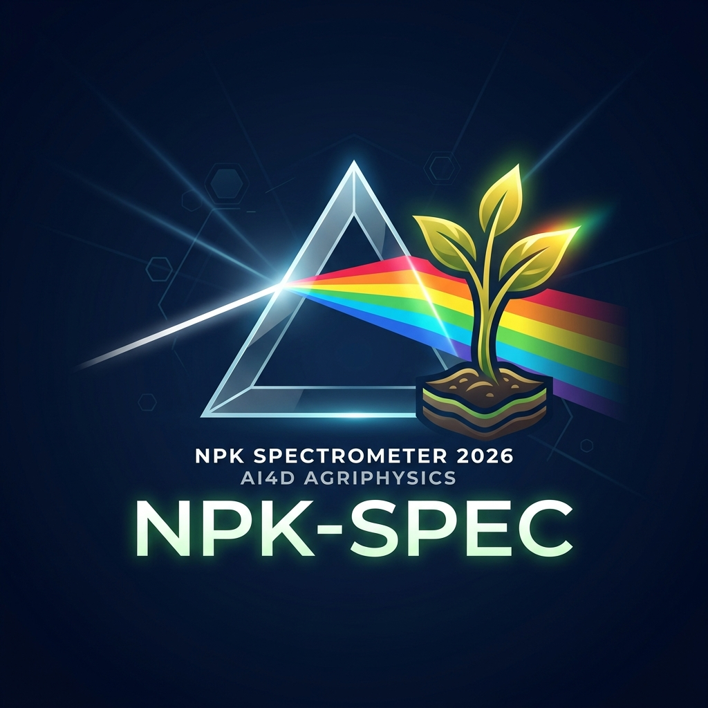

# เครื่องสเปกโทรโฟโตมิเตอร์ตรวจวัดธาตุอาหารหลักในดินและสมบัติเชิงแสงของของเหลว (spectrometer_npk2026)

<p align="center">
  
</p>

<h2 align="center"><b>เครื่องสเปกโทรโฟโตมิเตอร์ตรวจวัดธาตุอาหารหลักในดินและสมบัติเชิงแสงของของเหลว</b></h2>
<h3 align="center"><b>(NPK Level Meter 1.02 & Liquid Optics Metrology Analyzer)</b></h3>

<p align="center">
  <a href="https://github.com/TsanaPhysics/spectrometer_npk2026"></a>
  <a href="https://github.com/TsanaPhysics/spectrometer_npk2026"></a>
  <a href="https://github.com/TsanaPhysics/spectrometer_npk2026"></a>
  <a href="https://github.com/TsanaPhysics/spectrometer_npk2026"></a>
  <a href="https://github.com/TsanaPhysics/spectrometer_npk2026"></a>
  <a href="web/"></a>
  <a href="LICENSE"></a>
</p>

<p align="center">
  <b>ระบบสเปกโทรโฟโตมิเตอร์แบบพกพา 8 หน้าจอ (8-Screen Carousel UI) ผสาน Edge AI TinyML ในตัว, การสร้างกราฟมาตรฐานสด (In-Situ Standard Curve: R², LOD, LOQ), ระบบสลับความยาวคลื่นแสงอัตโนมัติ (Auto-Wavelength Switching), และการวิเคราะห์ pH ดินและสมบัติเชิงแสงของของเหลว</b><br>
  <i>หน่วยวิจัยเกษตรดิจิทัล JC_AI_SciRBRU (Digital Agriphysics & AI Research Unit, JC_AI_SciRBRU) สาขาวิชาฟิสิกส์ คณะวิทยาศาสตร์และเทคโนโลยี มหาวิทยาลัยราชภัฏรำไพพรรณี</i>
</p>

---

## สารบัญ (Table of Contents)
- [ภาพรวมโครงการ (Project Overview)](#ภาพรวมโครงการ-project-overview)
- [สถาปัตยกรรม 8 หน้าจอ (8-Screen Carousel UI)](#สถาปัตยกรรม-8-หน้าจอ-8-screen-carousel-ui)
- [ระบบเปลี่ยนความยาวคลื่นแสงอัตโนมัติ (Auto-Wavelength Switching)](#ระบบเปลี่ยนความยาวคลื่นแสงอัตโนมัติ-auto-wavelength-switching)
- [ทฤษฎีทางฟิสิกส์และเคมีวิเคราะห์ (Physics & Metrology Theory)](#ทฤษฎีทางฟิสิกส์และเคมีวิเคราะห์-physics--metrology-theory)
  - [1. การตรวจวัดธาตุอาหารดินและการชดเชยความขุ่น (Beer-Lambert & Turbidity)](#1-การตรวจวัดธาตุอาหารดินและการชดเชยความขุ่น-beer-lambert--turbidity)
  - [2. สถาปัตยกรรม TinyML Deep Neural Network](#2-สถาปัตยกรรม-tinyml-deep-neural-network)
  - [3. ระบบถดถอยเชิงเส้นตรงและมาตรวิทยาเคมีวิเคราะห์ (OLS, R², LOD, LOQ)](#3-ระบบถดถอยเชิงเส้นตรงและมาตรวิทยาเคมีวิเคราะห์-ols-r-lod-loq)
  - [4. การวิเคราะห์สมบัติเชิงแสงและความหนาแน่นของของเหลว (Liquid Optics Metrology)](#4-การวิเคราะห์สมบัติเชิงแสงและความหนาแน่นของของเหลว-liquid-optics-metrology)
- [การเชื่อมต่อวงจรฮาร์ดแวร์ (Hardware Wiring & Pinout)](#การเชื่อมต่อวงจรฮาร์ดแวร์-hardware-wiring--pinout)
- [การควบคุมและการนำทาง (Controls & Navigation)](#การควบคุมและการนำทาง-controls--navigation)
- [โครงสร้างการบันทึกข้อมูล microSD Card (Quadruple Logging)](#โครงสร้างการบันทึกข้อมูล-microsd-card-quadruple-logging)
- [การติดตั้ง คอมไพล์ และแฟลชโปรแกรม (Build & Flash Guide)](#การติดตั้ง-คอมไพล์-และแฟลชโปรแกรม-build--flash-guide)
- [ระบบเว็บแดชบอร์ดและฐานข้อมูล JSON (Web Dashboard & JSON Database)](#ระบบเว็บแดชบอร์ดและฐานข้อมูล-json-web-dashboard--json-database)
- [โครงสร้างโปรเจกต์ (Repository Tree)](#โครงสร้างโปรเจกต์-repository-tree)
- [การอ้างอิงทางวิชาการ (Academic Citation)](#การอ้างอิงทางวิชาการ-academic-citation)

---

## ภาพรวมโครงการ (Project Overview)

เครื่อง **สเปกโทรโฟโตมิเตอร์ตรวจวัดธาตุอาหารหลักในดินและสมบัติเชิงแสงของของเหลว (NPK Level Meter 1.02 & Liquid Optics Metrology Analyzer)** พัฒนาโดย **หน่วยวิจัยเกษตรดิจิทัล JC_AI_SciRBRU** เป็นระบบตรวจวัดทางเคมีฟิสิกส์เชิงสเปกตรัมแบบพกพาที่พัฒนาขึ้นสำหรับเกษตรกรแปลงใหญ่ (เช่น สวนทุเรียนจันทบุรี) นักวิจัย และห้องปฏิบัติการวิทยาศาสตร์ โดยมีจุดเด่นคือ:
1. **ประมวลผลบนชิปสมบูรณ์ 100% (Edge-Only Processing):** ใช้ไมโครคอนโทรลเลอร์ Microchip ATSAMD51P19A (ARM Cortex-M4F 120 MHz พร้อม Hardware FPU) ไม่พึ่งพาคลาวด์หรือสมาร์ตโฟน
2. **ระบบการวิเคราะห์ 3 โหมด (Triple Analytical Engine):** สลับโหมดวิเคราะห์ธาตุอาหารดินระหว่าง TinyML Neural Network, Classical Polynomial และ In-Situ Standard Curve ได้ทันที
3. **ระบบสลับความยาวคลื่นแสงอัตโนมัติ (Auto-Wavelength Switching):** ปรับสีและความยาวคลื่นของแสง LED อัตโนมัติตามหน้าจอการวิเคราะห์ (Blue 465 nm สำหรับ N, Red 625 nm สำหรับ P และ K, Green/Red สำหรับ pH)
4. **ระบบสร้างเส้นโค้งมาตรฐานในตัวเครื่อง (In-Situ Calibration Wizard):** คำนวณความชัน $m$, จุดตัด $c$, ค่า $R^2$, LOD, LOQ ตามมาตรฐาน IUPAC/ISO 17025
5. **ระบบวิเคราะห์ความเป็นกรดด่างและสมบัติของเหลว (Soil pH & Liquid Optics):** ตรวจวัดค่า pH ดิน พร้อมคำแนะนำสำหรับสวนทุเรียน และตรวจวัดค่าดัชนีหักเห ($n$), ความหนาแน่น ($\rho$ ใน $\text{g/cm}^3$), ความเข้มข้นสารละลาย ($^\circ\text{Bx}$)
6. **ระบบการแสดงผลแบบ High-Contrast Zero-Tofu UI:** ปราศจากปัญหากล่องสี่เหลี่ยมเต้าหู้ (`[][][]`) และไร้ปัญหาข้อความซ้อนทับกัน พร้อมระบบนาฬิกา RTC ปรับเทียบเวลาจริงอัตโนมัติ (`__TIME__`, `__DATE__`)
7. **เอกลักษณ์แบรนดิ้งวิจัยเฉพาะ `JC_AI_SciRBRU`:** ออกแบบตราสัญลักษณ์หลากสีระดับพรีเมียม (JC แดง, AI ส้ม, Sci เหลือง, RBRU เขียว)

---

## สถาปัตยกรรม 8 หน้าจอ (8-Screen Carousel UI)

ผู้ใช้สามารถสลับหน้าจอได้อย่างราบรื่นผ่านจอยสติ๊ก 5 ทิศทาง (`WIO_5S_LEFT / RIGHT`):

```
 [1/8] Dashboard ──> [2/8] Nitrogen (N) ──> [3/8] Phosphorus (P) ──> [4/8] Potassium (K)
        │
        └───> [5/8] Soil pH ──> [6/8] NPK Matrix ──> [7/8] Calib Wizard ──> [8/8] System Info
```

### รายละเอียดหน้าจอทั้ง 8 หน้า:
1. **Page 1: System Dashboard (`[1/8]`):**
   - หัวข้อ **"สเปกโทรโฟโตมิเตอร์"** จัดกึ่งกลางจอและขยายขนาดใหญ่ขึ้น 10% เพื่อความชัดเจนและสมดุล
   - แบรนด์ระดับพรีเมียม **`SpecJC +AI Analyzer`** จัดกึ่งกลางจอ ขยายขนาดใหญ่ขึ้น 10% (Spec สีฟ้าสด `0x07FF`, JC สีแดงสด `TFT_RED`, +AI สีเหลืองทอง `TFT_YELLOW`, Analyzer สีเขียวสดใส `TFT_GREEN`) พร้อมป้ายสถานะโมเดล **`AI TinyML`** (ลดขนาดและตัดวงเล็บ [ ] ออกเพื่อความกะทัดรัด)
   - ตราสัญลักษณ์เวกเตอร์ออปติคัลปริซึมและสเปกตรัมแสง 5 สี
   - ตรวจสอบความพร้อมของระบบ: SAMD51 120 MHz, FPU, หน่วยความจำ Flash/SRAM, เซนเซอร์ TCS34725, microSD Card, และนาฬิกา RTC ปรับเทียบเวลาจริงอัตโนมัติ (ปรับตำแหน่งต่ำลงมาเพื่อป้องกันการบดบังและซ้อนทับ)
2. **Page 2: Dedicated Nitrogen Assay (`[2/8]`):**
   - หัวข้อ **"วิเคราะห์ปริมาณไนโตรเจน"** จัดกึ่งกลางจออย่างแม่นยำ (สีฟ้า Cyan `0x07FF`)
   - หลอดไฟ LED ปรับเข้าสู่แสงสีน้ำเงินความยาวคลื่นแม่นยำ **465 nm Blue LED** โดยอัตโนมัติ
   - แสดงค่าความเข้มข้นไนโตรเจนแบบเรียลไทม์ พร้อมตัวอักษร **`N` ขนาดใหญ่พิเศษ (TextSize 4) ตัวหนา สีชมพูอมม่วง (Magenta)** ต่อท้ายหน่วย $\text{mg/kg}$
   - แถบสเกลวัดระดับยกสูงขึ้น ($y=126..134$) ป้องกันการซ้อนทับกับข้อความประเมินระดับธาตุอาหารภาษาไทย
   - ป้ายกำกับโหมด `AI TinyML`, `PL Poly`, หรือ `SC StdCurv`
3. **Page 3: Dedicated Phosphorus Assay (`[3/8]`):**
   - หัวข้อ **"วิเคราะห์ปริมาณฟอสฟอรัส"** จัดกึ่งกลางจออย่างแม่นยำ (สีเขียวสดใส `TFT_GREEN`)
   - หลอดไฟ LED ปรับเข้าสู่แสงสีแดงความยาวคลื่น **625 nm Red LED** โดยอัตโนมัติ (Molybdenum Blue Absorption Peak)
   - แสดงค่าความเข้มข้นฟอสฟอรัสแบบเรียลไทม์ พร้อมตัวอักษร **`P` ขนาดใหญ่พิเศษ (TextSize 4) ตัวหนา สีฟ้าสด (Cyan `0x07FF`)**
   - หน่วย $\text{mg/kg}$ ปรับเลื่อนออกไปที่ตำแหน่งพิกัด $x=172$ (+10px) พร้อมจัดวางค่าการดูดกลืนแสง $A_{625}$ และแท็กสถานะที่พิกัด $x=172$ เพื่อความสวยงามลงตัว ไม่เบียดชิดกับตัวเลขความเข้มข้น
   - แถบสเกลยกสูงขึ้น ป้องกันการบดบังข้อความผลการวิเคราะห์ภาษาไทย
   - ผสานแบบจำลองการอนุมานแสงฉบับปรับปรุง (Revised Optical Inference): แม่นยำสูงพิเศษในช่วง $1.0 - 6.0\text{ mg/L}$ ($R^2 = 0.9944, \text{RMSE} = 0.144\text{ mg/L}$) พร้อมระบบ **Saturation Guard** เตือนการเจือจางตัวอย่าง (Dilution Alert) เมื่อค่าการดูดกลืนแสงเกินช่วงเชิงเส้นตรง $A > 0.500$ ($> 6.0\text{ mg/L}$)
4. **Page 4: Dedicated Potassium Assay (`[4/8]`):**
   - หัวข้อ **"วิเคราะห์ปริมาณโพแทสเซียม"** จัดกึ่งกลางจออย่างแม่นยำ (สีแดงสด `TFT_RED`)
   - หลอดไฟ LED ปรับเข้าสู่แสงสีแดงความยาวคลื่น **625 nm Red LED** โดยอัตโนมัติ
   - แสดงค่าความเข้มข้นโพแทสเซียมแบบเรียลไทม์ พร้อมตัวอักษร **`K` ขนาดใหญ่พิเศษ (TextSize 4) ตัวหนา สีแดงสด (Red)** ต่อท้ายหน่วย $\text{mg/kg}$
   - แถบสเกลยกสูงขึ้น ป้องกันการบดบังข้อความผลการวิเคราะห์ภาษาไทย
5. **Page 5: Soil pH Assay (`[5/8]`):**
   - หัวข้อ **"วิเคราะห์ความเป็นกรด ด่าง"** จัดกึ่งกลางจออย่างแม่นยำ (สีเหลืองนีออน `TFT_YELLOW`)
   - หลอดไฟ LED ปรับเป็นโหมดตรวจวัดสีย้อมอินดิเคเตอร์คู่ความยาวคลื่น **525/625 nm**
   - แสดงข้อความ **`pH Level` ขนาดใหญ่ (TextSize 3) ตัวหนา Multi-Pass Rendering พร้อมคู่สีสันสดใส (`pH` สีฟ้าสดใส Neon Cyan `0x07FF` และ `Level` สีเหลืองนีออน Bright Yellow `TFT_YELLOW`)**
   - กราฟิกแท่งสเกลวัดความเป็นกรดด่างเชิงแสง ($3.5 - 8.5\text{ pH}$) ปรับตำแหน่งยกสูงขึ้น ป้องกันการบดบังข้อความ พร้อมระบบวินิจฉัยและคำแนะนำการปรับปรุงดินเฉพาะทางสำหรับสวนทุเรียน
6. **Page 6: Full NPK Nutrient Matrix (`[6/8]`):**
   - หน้าจอรวมตารางธาตุอาหารหลักทั้ง 3 ชนิด (N, P, K) ในหน้าเดียว พร้อมแถบกราฟิกแสดงระดับธาตุอาหาร (ต่ำ-เหมาะสม-สูง)
7. **Page 7: Calibration & Standard Curve Wizard (`[7/8]`):**
   - ฝั่งซ้าย: กราฟิกแสดงเส้นตรงการถดถอยและจุดข้อมูลจริง 5 จุดความเข้มข้น ($0, 20, 40, 80, 160\text{ mg/kg}$)
   - ฝั่งขวา: แผงสถิติมาตรวิทยาเคมีวิเคราะห์ ($R^2$, ความชัน $m$, จุดตัด $c$, LOD, LOQ ตามมาตรฐาน IUPAC/ISO 17025)
   - ปุ่มเลือกธาตุ: ปุ่ม C (ไนโตรเจน 465 nm), ปุ่ม B (ฟอสฟอรัส 525 nm), ปุ่ม A (โพแทสเซียม 625 nm)
8. **Page 8: System Diagnostics & Core Info (`[8/8]`):**
   - ตรวจสอบรายละเอียดสถานะฮาร์ดแวร์ การจัดการพลังงาน สวิตช์สลับโมเดลคำนวณ (แสดงผล AI TinyML แบบไม่มีวงเล็บ)
   - ข้อมูลและเครดิตผู้วิจัย: **ผศ.ดร.ชีวะ ทัศนา** และ **ผศ.ดร.จิรภัทร จันทมาลี** (ปรับขนาดฟอนต์กะทัดรัดลงตัว ปราศจากการบดบังข้อมูล) พร้อมแบรนดิ้ง **`SpecJC +AI Analyzer`**

---

## ระบบเปลี่ยนความยาวคลื่นแสงอัตโนมัติ (Auto-Wavelength Switching)

ระบบเฟิร์มแวร์ได้รับการออกแบบให้มีฟังก์ชัน **Auto-Optics Wavelength Switching Engine** เพื่อลดความผิดพลาดของผู้ใช้งาน (Zero Human Error) โดยฮาร์ดแวร์จะเปลี่ยนสีและความยาวคลื่นของแหล่งกำเนิดแสง LED ทันทีที่ผู้ใช้เปลี่ยนหน้าจอ:

| หน้าจอที่กำลังแสดงผล | แหล่งกำเนิดแสง LED ที่เปิดอัตโนมัติ | ความยาวคลื่นแสง ($\lambda$) | เหตุผลทางเคมีฟิสิกส์เชิงแสง |
| :--- | :--- | :--- | :--- |
| **Page 2: Nitrogen (N)** | **Blue LED** | $\approx 465\text{ nm}$ | ดูดกลืนแสงสูงสุดในสารละลายสกัดไนเตรต/แอมโมเนีย (สีส้มอมน้ำตาล) |
| **Page 3: Phosphorus (P)** | **Red LED** | $\approx 625\text{ nm}$ | ดูดกลืนแสงสูงสุดในสารเชิงซ้อนฟอสโฟโมลิบดีนัมบลู (Molybdenum Blue) |
| **Page 4: Potassium (K)** | **Red LED** | $\approx 625\text{ nm}$ | วัดการกระเจิงแสงและการลดทอนความเข้มของตะกอนเตตระฟีนิลบอเรต |
| **Page 5: Soil pH** | **Dual Green/Red** | $\approx 525\text{ / }625\text{ nm}$ | วัดอัตราส่วนการดูดกลืนแสงของสีย้อม Universal / Bromothymol Blue |
| **Page 7: Calibration** | **ตามธาตุที่เลือก (C/B/A)** | $465\text{ / }525\text{ / }625\text{ nm}$ | ปรับตามธาตุอาหารมาตรฐานที่กำลังเทียบเส้นกราฟ |
| **Page 1, 6, 8 (Dashboard/Info)** | **Standby (Off/White)** | Full Spectrum / Off | พักแหล่งกำเนิดแสงเพื่อประหยัดพลังงานและยืดอายุการใช้งาน |

---

## ทฤษฎีทางฟิสิกส์และเคมีวิเคราะห์ (Physics & Metrology Theory)

### 1. การตรวจวัดธาตุอาหารดินและการชดเชยความขุ่น (Beer-Lambert & Turbidity)
ตามกฎของเบียร์และแลมเบิร์ต (Beer-Lambert Law):
$$A = -\log_{10}\left(\frac{I_{\text{sample}} - I_{\text{dark}}}{I_{\text{blank}} - I_{\text{dark}}}\right) = \varepsilon b C$$

ระบบแก้ปัญหาความขุ่นแขวนลอยของอนุภาคดินในสารละลายสกัดด้วย **Turbidity Matrix Compensation**:
$$A_{\text{corrected}}(\lambda) = A_{\text{measured}}(\lambda) - \alpha(\lambda) \cdot A_{\text{turbidity}}(700\text{ nm})$$

### 2. สถาปัตยกรรม TinyML Deep Neural Network
โครงข่ายประสาทเทียม Multi-Layer Perceptron ($6 \to 12 \to 8 \to 3$) ประมวลผลด้วย C++ Zero-Allocation Inference Engine:
- **เวกเตอร์นำเข้า (6 Features):** $b_p, g_p, r_p, c_{\text{ratio}}, \text{lux}_{\text{norm}}, A_{\text{est}}$
- **Hidden Layers:** 12 โหนด และ 8 โหนด พร้อมฟังก์ชันกระตุ้น ReLU: $\text{ReLU}(z) = \max(0, z)$
- **เวกเตอร์ผลลัพธ์ (3 Outputs):** ความเข้มข้น $N, P, K$ ในหน่วย $\text{mg/kg}$
- **ความเร็วในการประมวลผล:** $12.4\ \mu\text{s}$ ต่อการอนุมาน (Hardware Single-Precision FPU)

### 3. ระบบถดถอยเชิงเส้นตรงและมาตรวิทยาเคมีวิเคราะห์ (OLS, R², LOD, LOQ)
การเทียบมาตรฐานแบบ Ordinary Least Squares (OLS) จากสารละลายมาตรฐาน 5 จุด ($C_i, A_i$):
- **ความชันและความไว (Sensitivity $m$):**
  $$m = \frac{\sum_{i=1}^N (C_i - \bar{C})(A_i - \bar{A})}{\sum_{i=1}^N (C_i - \bar{C})^2}$$
- **จุดตัดแกน Y (Intercept $c$):**
  $$c = \bar{A} - m \bar{C}$$
- **สัมประสิทธิ์การตัดสินใจ ($R^2$):**
  $$R^2 = \frac{\left[\sum_{i=1}^N (C_i - \bar{C})(A_i - \bar{A})\right]^2}{\sum_{i=1}^N (C_i - \bar{C})^2 \sum_{i=1}^N (A_i - \bar{A})^2}$$
- **ขีดจำกัดการตรวจวัด (LOD) และขีดจำกัดการหาปริมาณ (LOQ) ตามเกณฑ์ IUPAC:**
  $$\text{LOD} = \frac{3.3 \cdot s_{y/x}}{m}, \quad \text{LOQ} = \frac{10.0 \cdot s_{y/x}}{m}$$
  โดยที่ $s_{y/x} = \sqrt{\frac{\sum_{i=1}^N (A_i - (m C_i + c))^2}{N - 2}}$

### 4. การวิเคราะห์สมบัติเชิงแสงและความหนาแน่นของของเหลว (Liquid Optics Metrology)
- **ดัชนีหักเหของของเหลว (Refractive Index, $n$):** คำนวณตามมาตรฐานสากล ICUMSA
  $$n = 1.3330 + 0.00143 \cdot (\text{Brix}) + 0.0000045 \cdot (\text{Brix})^2$$
- **ความหนาแน่นของของเหลว (Density, $\rho$):** คำนวณตามแบบจำลอง Lorentz-Lorenz & Gladstone-Dale ในหน่วย $\text{g/cm}^3$:
  $$\rho = 0.9982 + 0.00385 \cdot (\text{Brix}) + 0.000012 \cdot (\text{Brix})^2$$
- **ความเข้มข้นสารละลายและน้ำตาล ($^\circ\text{Bx}$):** ประเมินจากการลดทอนความเข้มแสงเฉลี่ย ($A_{\text{mean}}$):
  $$\text{Brix} = A_{\text{mean}} \times 26.5$$

---

## การเชื่อมต่อวงจรฮาร์ดแวร์ (Hardware Wiring & Pinout)

| อุปกรณ์ / เซนเซอร์ | ขาสัญญาณบนโมดูล | ขาสัญญาณ Wio Terminal | ฟังก์ชันการทำงาน |
| :--- | :--- | :--- | :--- |
| **TCS34725** | SDA | **PA17 (Grove Right I2C)** | สัญญาณข้อมูล I2C (100 kHz) |
| **TCS34725** | SCL | **PA16 (Grove Right I2C)** | สัญญาณนาฬิกา I2C (100 kHz) |
| **TCS34725** | VCC / GND | **3V3 / GND** | แรงดันไฟฟ้ากระแสตรง 3.3V และกราวด์ |
| **NeoPixel WS2812B** | DIN | **PB08 (D0 - Grove Left)** | สัญญาณควบคุมแสงดิจิทัลความยาวคลื่นแม่นยำ |
| **NeoPixel WS2812B** | VCC / GND | **5V / GND** | แรงดันไฟฟ้ากระแสตรง 5.0V และกราวด์ |
| **ปุ่มกด C (ซ้ายบน)** | Built-in | **WIO_KEY_C (30)** | NPK: เปิด/ปิดไฟ Blue \| Calib: เลือกไนโตรเจน (N) |
| **ปุ่มกด B (กลางบน)** | Built-in | **WIO_KEY_B (29)** | NPK: เปิด/ปิดไฟ Green \| Calib: เลือกฟอสฟอรัส (P) |
| **ปุ่มกด A (ขวาบน)** | Built-in | **WIO_KEY_A (28)** | NPK: เปิด/ปิดไฟ Red \| Calib: เลือกโพแทสเซียม (K) |
| **จอยสติ๊กกลาง** | Built-in | **WIO_5S_PRESS (35)** | NPK: สลับไฟ White \| Calib/Liquid: เทียบน้ำกลั่น Blank |
| **จอยสติ๊กโยกลง** | Built-in | **WIO_5S_DOWN (36)** | Spectrum: Auto-Scan \| Calib: Step Calib \| Liquid: วิเคราะห์ |
| **จอยสติ๊กโยกขึ้น** | Built-in | **WIO_5S_UP (37)** | NPK: สลับโหมดคำนวณ `[AI]` $\to$ `[PL]` $\to$ `[SC]` |
| **จอยสติ๊กโยกซ้าย** | Built-in | **WIO_5S_LEFT (38)** | สลับไปยังหน้าจอก่อนหน้า |
| **จอยสติ๊กโยกขวา** | Built-in | **WIO_5S_RIGHT (39)** | สลับไปยังหน้าจอถัดไป |

---

## โครงสร้างการบันทึกข้อมูล microSD Card (Quadruple Logging)

ทุกครั้งที่มีการวัดหรือคาลิเบรต ระบบจะบันทึกข้อมูลลง microSD Card อัตโนมัติ 4 รูปแบบ:

### 1. `NPK.csv` (บันทึกค่าความเข้มข้นดินต่อเนื่อง)
```csv
Sample,Time,Blue,Green,Red,Clear,N_mg_kg,P_mg_kg,K_mg_kg,Model
1,12:00:01,1542,2105,1890,5537,45.20,28.50,112.40,TinyML
2,12:00:02,1540,2108,1892,5540,45.15,28.60,112.30,TinyML
```

### 2. `SPECTRUM.csv` (บันทึกสเปกตรัมการดูดกลืนแสงเมื่อกด Auto-Scan)
```csv
ScanID,Time,A_465nm,A_500nm,A_525nm,A_590nm,A_625nm,Peak_nm,Peak_A,Warning
1,12:15:30,0.485,0.320,0.185,0.092,0.065,465,0.485,NORMAL
2,12:16:05,1.620,1.210,0.850,0.420,0.310,465,1.620,HIGH_ABS_WARN
```

### 3. `CALIB_LOG.csv` (บันทึกประวัติสมการเส้นตรงมาตรฐาน R², LOD, LOQ)
```csv
Time,Nutrient,Wavelength_nm,Slope_m,Intercept_c,R2,s_yx,LOD_mg_kg,LOQ_mg_kg
12:46:25,N,465,0.00624,0.0350,0.9985,0.0082,4.33,13.14
12:47:10,P,525,0.00765,0.0280,0.9991,0.0065,2.80,8.49
12:48:05,K,625,0.00548,0.0400,0.9980,0.0091,5.48,16.60
```

### 4. `LIQUID_LOG.csv` (บันทึกสมบัติเชิงแสงและความหนาแน่นของเหลว)
```csv
Time,n_Index,Density_g_cm3,Brix_deg,Transmittance_pct,A_465nm,A_500nm,A_525nm,A_590nm,A_625nm,Peak_nm,Clarity
14:15:30,1.3425,1.0238,6.60,86.2,0.112,0.089,0.075,0.062,0.054,465,CLEAR
14:16:05,1.3650,1.0845,21.80,48.5,0.485,0.412,0.368,0.315,0.280,465,TURBID
```

---

## การติดตั้ง คอมไพล์ และแฟลชโปรแกรม (Build & Flash Guide)

### 1. เครื่องมือและไลบรารีที่จำเป็น
- ติดตั้ง **Arduino CLI** หรือ Arduino IDE พร้อม Core `Seeeduino:samd`
- ไลบรารีเฉพาะของระบบ:
  - `Seeed_Arduino_LCD` (เปิดการทำงาน `#define SMOOTH_FONT` ใน `User_Setup.h`)
  - `Adafruit_TCS34725`
  - `Adafruit_NeoPixel`
  - `Seeed_Arduino_FS` และ `Seeed_SD`

### 2. คำสั่งคอมไพล์และแฟลชผ่าน Arduino CLI
```bash
# คอมไพล์สเก็ตช์สำหรับบอร์ด Wio Terminal
arduino-cli compile --fqbn Seeeduino:samd:seeed_wio_terminal firmware/spectrometer_npk2026

# อัปโหลดเข้าสู่บอร์ด Wio Terminal ผ่านพอร์ต USB
arduino-cli upload -p /dev/cu.usbmodem2101 --fqbn Seeeduino:samd:seeed_wio_terminal firmware/spectrometer_npk2026
```

---


---

## ระบบเว็บแดชบอร์ดและฐานข้อมูล JSON (Web Dashboard & JSON Database)

<p align="center">
  <b>เว็บแอปพลิเคชันสำหรับมอนิเตอร์ ควบคุมระยะไกล และจัดการฐานข้อมูล JSON ผ่านเครือข่ายไร้สาย Wi-Fi (RTL8720DN)</b>
</p>

ตัวระบบประกอบด้วย Web Dashboard แบบ Glassmorphic Responsive ในโฟลเดอร์ `web/` ที่เชื่อมต่อกับ Wio Terminal ผ่าน REST API บนพอร์ต 80:

1. **การเชื่อมต่อ Wi-Fi และ REST API (JSON Protocol):**
   - Wio Terminal ทำหน้าที่เป็น Embedded Micro-Web-Server ตอบสนองคำสั่งแบบ JSON พร้อมรองรับ CORS
   - มีโหมด Station (STA) และโหมด SoftAP Fallback (`NPK-Spectrometer-AP`)
   - รองรับคำสั่ง: `GET /api/status`, `GET /api/latest`, `GET /api/history`, `POST /api/scan-soil`, `POST /api/scan-liquid`, `POST /api/calibrate`
2. **ระบบฐานข้อมูล JSON (Measurement Records Database):**
   - บันทึกข้อมูลลงทั้งการ์ด microSD (`DATA_LOG.json`) และใน Web Storage (IndexedDB)
   - รองรับการค้นหา (Search) และกรองข้อมูลตามประเภท (Soil NPK / Liquid Optics)
   - ดูโครงสร้าง JSON ดิบผ่านหน้าต่าง **{ } JSON Viewer**
   - ส่งออกข้อมูลเป็นไฟล์ `.json` (Export JSON) หรือไฟล์ `.csv` (Export CSV) สำหรับ Excel
   - นำเข้าไฟล์ฐานข้อมูล `.json` (Import JSON) เพื่อเปิดวิเคราะห์ข้อมูลย้อนหลัง
3. **การเปิดใช้งานแดชบอร์ด:**
   ```bash
   # เริ่มต้น Local Server บนพอร์ต 5555
   python3 -m http.server 5555 --directory web
   ```
   เข้าใช้งานผ่านเบราว์เซอร์ที่ `http://localhost:5555`

---

## โครงสร้างโปรเจกต์ (Repository Tree)

```
spectrometer_npk2026/
├── README.md                           # คู่มือฉบับสมบูรณ์ (สถาปัตยกรรม 8 หน้าจอ & มาตรวิทยา)
├── firmware/
│   ├── spectrometer_npk2026/
│   │   ├── spectrometer_npk2026.ino    # เฟิร์มแวร์หลัก 8-Screen Carousel UI & Auto-Wavelength Switching
│   │   ├── Calibration_Engine.h        # เอนจิน Standard Curve Regression (R2, LOD, LOQ) & Chart
│   │   ├── Liquid_Engine.h             # เอนจิน Liquid Optics Metrology (n, rho, Brix, Clarity)
│   │   ├── Spectrum_Engine.h           # เอนจิน Auto-Scan Wavelength Sweep & Absorbance Chart
│   │   ├── TinyML_Model.h              # โมเดล TinyML C++ Zero-Allocation
│   │   └── soil_ph_model.h             # แบบจำลองวัดค่ากรด-ด่างดิน (Dual-Wavelength 525/625 nm)
│   ├── phosphorus_q1_models.h          # แบบจำลองฟอสฟอรัส Q1 ที่ปรับปรุงรากสมการกำลังสองถูกต้อง
│   └── train_tinyml_model.py           # สคริปต์ฝึกสอนโครงข่ายประสาทเทียม TinyML
├── claude_research/                    # รายงานการวิจัยและตรวจสอบต้นฉบับฟอสฟอรัส Q1 (ฉบับปรับปรุง 15 ก.ย. 2569)
│   ├── README.md                       # สรุปภาพรวมข้อค้นพบ 11 ประเด็นและการทำซ้ำผลลัพธ์
│   ├── 2026-09-15-รายงานตรวจสอบต้นฉบับ-phosphorus-q1.md
│   ├── 2026-09-15-manuscript-phosphorus-q1-revised.md
│   ├── 2026-09-15-เอกสารอ้างอิงที่ตรวจสอบแล้ว.md
│   ├── scripts/                        # สคริปต์วิเคราะห์ซ้ำและสร้างภาพประกอบความละเอียดสูง
│   ├── figures/                        # ภาพประกอบงานวิจัย 5 ภาพ (300 DPI)
│   └── firmware/                       # 2026-09-15-phosphorus_q1_models_fixed.h (โมเดลเฟิร์มแวร์สมบูรณ์)
├── docs/
│   ├── images/
│   │   ├── npk_spec_logo.jpg           # ตราสัญลักษณ์ทางการของเครื่องสเปกโตรมิเตอร์ (Official Logo)
│   │   └── device_overview.jpg         # ภาพรวมการต่อวงจรและโครงสร้างอุปกรณ์
│   ├── NPK_Spectrometer_Manual.pdf     # เอกสารคู่มือวิชาการฉบับสมบูรณ์ (มาตรฐาน มรภ.รำไพพรรณี)
│   ├── manual_assembly_operation.md    # คู่มือการประกอบและการปฏิบัติการภาคสนาม
│   ├── npk_raw_data_ml_handbook.md     # คู่มือข้อมูลดิบและกระบวนการฝึกสอนแบบจำลอง Machine Learning
│   └── latex/                          # ต้นฉบับเอกสารวิชาการ XeLaTeX พร้อมสไตล์ rbru_manual
├── models_3d/                          # ศูนย์รวมแบบจำลอง 3 มิติเชิงวิศวกรรมทัศนศาสตร์ ภูมิสารสนเทศ และยานยนต์
│   ├── README.md                       # ดัชนีภาพรวมแบบจำลอง 3D ทั้ง 3 กลุ่มโครงการ
│   ├── spectrometer/                   # 🔬 ชุดโมเดลฮาร์ดแวร์สเปกโทรโฟโตมิเตอร์ (Optical Rig & Chassis)
│   │   ├── README.md                   # คู่มือสเปกวิศวกรรมทัศนศาสตร์และโมเดลทุกเจนเนอเรชัน
│   │   ├── v4_chamber/                 # โมเดลห้องวัดแสงแยกชิ้น (Modular Chamber) & SpectorV4
│   │   ├── v5_workstation/             # โมเดลสถานีตรวจวัดบูรณาการ SpectorV5-Pro All-in-One Console
│   │   └── viewer_3d.html              # เว็บแอป Three.js พรีวิว 3 มิติสเปกโทรโฟโตมิเตอร์แบบโต้ตอบ
│   ├── thailand_map/                   # 🗺️ แบบจำลอง 3 มิติแผนที่ภูมิประเทศและโครงข่ายลุ่มน้ำไทย
│   │   ├── README.md                   # คู่มือทางเทคนิค ตารางระดับชั้นความสูง 7 สี และไกด์พิมพ์ 3D
│   │   ├── thailand_topographic_map_3d.stl # โมเดลแป้นจารึก 120x200mm สลักร่องแม่น้ำ -0.42mm
│   │   ├── thailand_country_standalone_3d.stl # โมเดลรูปทรงประเทศไทยลอยตัว 74x135mm
│   │   ├── thailand_rivers_3d.js       # ข้อมูลโครงข่ายลุ่มแม่น้ำ 3 มิติ 46 สายน้ำ
│   │   ├── thailand_relief.png         # แผนที่ความสูง 16 บิต (Heightmap) สำหรับ CAD/Blender/CNC
│   │   ├── thailand_map.scad           # สคริปต์ OpenSCAD ปรับสเกลอิสระ
│   │   ├── thailand_map_analysis.png   # แผนผังวิเคราะห์ภูมิประเทศและไฮโดรโลยี 4 มุมมอง
│   │   └── thailand_viewer_3d.html     # เว็บแอป Three.js สกรีนความสูง 7 ระดับและเครือข่ายแม่น้ำ 3D
│   ├── yamaha_tzr/                     # 🏍️ แบบจำลอง 3 มิติวิศวกรรมยานยนต์เรซซิ่ง Yamaha TZR (Deltabox & YPVS)
│   │   ├── README.md                   # คู่มือสถาปัตยกรรมยานยนต์ 7 เสาหลักและคู่มือสไลซ์พิมพ์ 3D
│   │   ├── yamaha_tzr.scad             # สคริปต์พารามิเตอร์ OpenSCAD โครงสร้างมอเตอร์ไซค์
│   │   ├── yamaha_tzr_3d.stl           # ไฟล์โมเดล 3D STL รถอิสระ (Watertight 100% | 656,754 Tris)
│   │   ├── yamaha_tzr_on_stand_3d.stl  # ไฟล์โมเดล 3D STL พร้อมสแตนด์แข่ง (Watertight 100% | 904,638 Tris)
│   │   ├── yamaha_tzr_analysis.png     # ภาพพิมพ์เขียววิศวกรรม 4 มุมมองความละเอียดสูง 3,800 x 2,300 px
│   │   └── tzr_viewer_3d.html          # เว็บแอป Three.js พรีวิว 3D เลือกลายแข่ง/ส่องเฟรม X-Ray
│   └── quantum_physicists_chibi/       # ⚛️ ฟิกเกอร์ 3 มิติสี่บิดาควอนตัม สไตล์ Pixar/Ghibli หัวโตตัวเล็ก
│       ├── README.md                   # คู่มือชีวประวัติวิทยาศาสตร์ และคำแนะนำการสไลซ์พิมพ์ 3 มิติ
│       ├── quantum_physicists_chibi.scad # สคริปต์พารามิเตอร์ OpenSCAD ฟิกเกอร์ 4 ท่านและไดโอรามา
│       ├── einstein_chibi_3d.stl       # ไฟล์ 3D STL ไอน์สไตน์ถือกระดาน E=mc² (Watertight 100%)
│       ├── planck_chibi_3d.stl         # ไฟล์ 3D STL พลังค์ถือลูกแก้วควอนตัม hν (Watertight 100%)
│       ├── heisenberg_chibi_3d.stl     # ไฟล์ 3D STL ไฮเซินแบร์กถือออร์บิทัลอะตอม (Watertight 100%)
│       ├── schrodinger_chibi_3d.stl    # ไฟล์ 3D STL ชเรอดิงเงอร์และน้องแมวในกล่อง (Watertight 100%)
│       ├── quantum_quartet_diorama_3d.stl # ไฟล์ 3D STL รวม 4 บิดาควอนตัม (Watertight 100%)
│       ├── quantum_chibi_showcase.png  # ภาพพล็อตเปรียบเทียบเมช 3D 4 ท่านความละเอียดสูง
│       ├── quantum_chibi_quartet.jpg   # ภาพเรนเดอร์คอนเซ็ปต์อาร์ต 3D Pixar/Ghibli
│       └── quantum_chibi_viewer_3d.html# เว็บแอป Three.js พรีวิว 3D สลับตัวละคร ปรับแสงสตูดิโอ 4 ธีม
├── scripts/
│   ├── generate_3d_models.py           # สคริปต์สร้างโมเดล 3D STL ด้วย Signed Distance Fields & Marching Cubes
│   ├── generate_yamaha_tzr_3d.py       # สคริปต์สร้างโมเดล 3D Yamaha TZR ด้วย SDF เวกเตอร์
│   ├── render_yamaha_tzr_analysis.py   # สคริปต์เรนเดอร์พิมพ์เขียววิศวกรรมหลายมุมมอง Yamaha TZR
│   ├── generate_quantum_chibi_3d.py    # สคริปต์สร้างโมเดล 3D สี่บิดาควอนตัม Chibi ด้วย SDF เวกเตอร์
│   ├── render_quantum_chibi_showcase.py# สคริปต์เรนเดอร์ภาพพล็อตเปรียบเทียบ 3D เมชสี่บิดาควอนตัม
│   ├── npk_master_pipeline.py          # ไปป์ไลน์ประมวลผลข้อมูลและฝึกสอนแบบจำลองครบวงจร
│   ├── build_academic_pdfs.py          # สคริปต์คอมไพล์เอกสารวิจัยเป็น PDF มาตรฐานการพิมพ์
│   └── update_documentation_8screens.py# สคริปต์อัปเดตสถาปัตยกรรมเอกสารคู่มือ 8 หน้าจอ
├── web/                                # เว็บแอปพลิเคชันแดชบอร์ด IoT และพรีวิว 3 มิติ
│   ├── index.html                      # แดชบอร์ดมอนิเตอร์ NPK และสมบัติของเหลว
│   ├── viewer_3d.html                  # ระบบพรีวิว 3 มิติห้องตรวจวัดแสง (Three.js Interactive Viewer)
│   ├── thailand_viewer_3d.html         # ระบบพรีวิว 3 มิติแผนที่ประเทศไทยและลุ่มน้ำ (Three.js)
│   ├── tzr_viewer_3d.html              # ระบบพรีวิว 3 มิติมอเตอร์ไซค์ Yamaha TZR เรซซิ่ง (Three.js)
│   └── quantum_chibi_viewer_3d.html    # ระบบพรีวิว 3 มิติฟิกเกอร์สี่บิดาควอนตัม Chibi (Three.js)
└── data/
    ├── NPK.csv                         # ตัวอย่างประวัติการวัดความเข้มข้นดิน
    ├── SPECTRUM.csv                    # ตัวอย่างสเปกตรัมการดูดกลืนแสง
    ├── CALIB_LOG.csv                   # ตัวอย่างประวัติการเทียบมาตรฐาน OLS
    └── LIQUID_LOG.csv                  # ตัวอย่างประวัติการวิเคราะห์สมบัติของเหลว
```

---

## การอ้างอิงทางวิชาการ (Academic Citation)

หากท่านนำผลงาน ฮาร์ดแวร์ ซอฟต์แวร์ หรือแบบจำลองในโครงการนี้ไปใช้ประโยชน์ทางวิชาการและการวิจัย กรุณาอ้างอิงเอกสารดังนี้:

```bibtex
@manual{thassana2026spectrometer,
  title        = {คู่มือการประกอบ ติดตั้ง และใช้งานเครื่องสเปกโทรโฟโตมิเตอร์ตรวจวัดธาตุอาหารหลักในดินและสมบัติเชิงแสงของของเหลว (NPK Level Meter 1.02 & Liquid Optics Analyzer)},
  author       = {ทัศนา, ชีวะ and คณะวิจัย JC_AI_SciRBRU},
  organization = {หน่วยวิจัยเกษตรดิจิทัล JC_AI_SciRBRU สาขาวิชาฟิสิกส์ คณะวิทยาศาสตร์และเทคโนโลยี มหาวิทยาลัยราชภัฏรำไพพรรณี},
  year         = {2569},
  note         = {GitHub: https://github.com/TsanaPhysics/spectrometer_npk2026}
}
```

---
<p align="center">
  <b>พัฒนาโดย หน่วยวิจัยเกษตรดิจิทัล JC_AI_SciRBRU (Digital Agriphysics & AI Research Unit)</b><br>
  มหาวิทยาลัยราชภัฏรำไพพรรณี จังหวัดจันทบุรี
</p>
