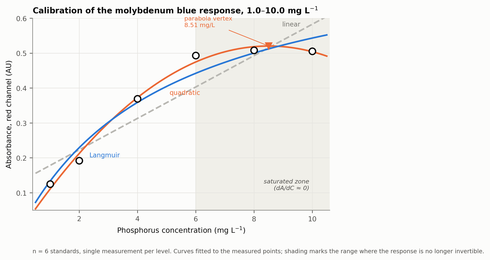
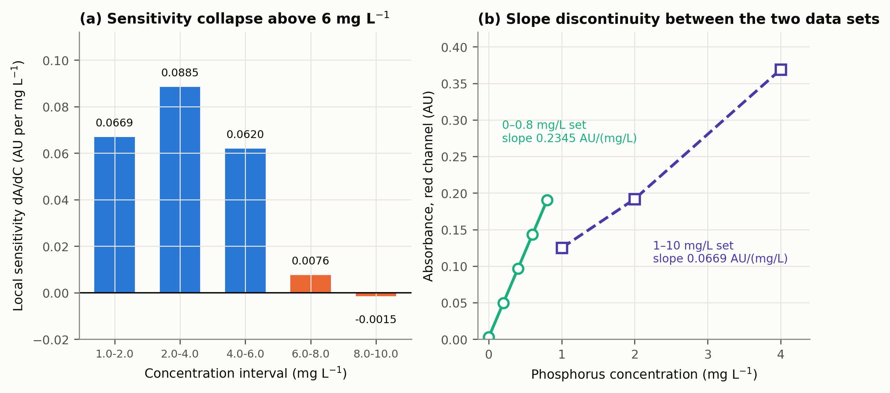
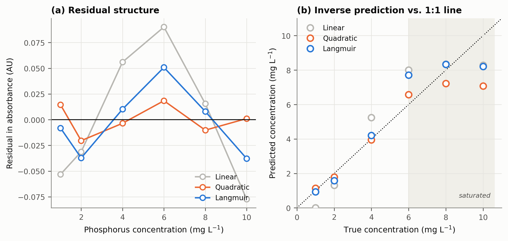
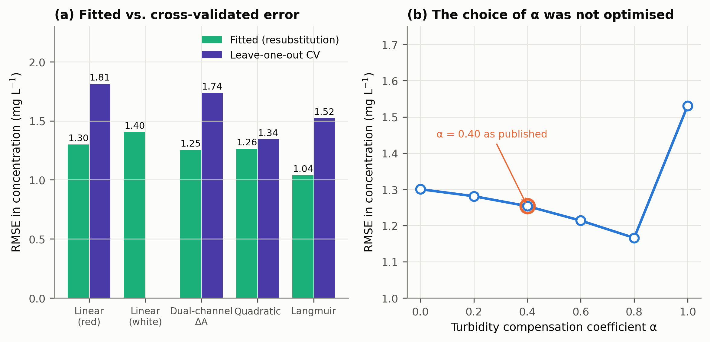
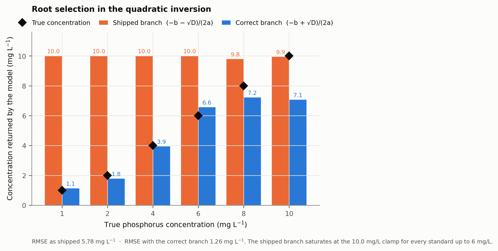

# การกำหนดช่วงใช้งานเชิงวิเคราะห์ของสเปกโตรมิเตอร์พกพาสำหรับตรวจวัดฟอสฟอรัสที่เป็นประโยชน์ต่อพืช: การอิ่มตัวของระบบตรวจวัดมีน้ำหนักเหนือการแก้ปัญหาด้วยแบบจำลองไม่เป็นเชิงเส้น

## Defining the Analytical Working Range of a Portable Spectrometer for Plant-Available Phosphorus: Detector Saturation Outweighs Non-Linear Model Correction

**ชีวะ ทัศนา (Chewa Thassana)**
สาขาวิชาดิจิทัลการเกษตรและสิ่งแวดล้อม คณะวิทยาศาสตร์และเทคโนโลยี
มหาวิทยาลัยราชภัฏรำไพพรรณี จันทบุรี 22000 ประเทศไทย
Corresponding author: chewa.t@rbru.ac.th

**สถานะเอกสาร** ร่างปรับปรุงครั้งที่ 1 วันที่ 15 กันยายน 2569
เอกสารนี้แทนที่ `manuscript_q1_phosphorus_modelling.md` ตามผลการตรวจสอบใน `2026-09-15-รายงานตรวจสอบต้นฉบับ-phosphorus-q1.md`
ตัวเลขทุกตัวในเอกสารนี้คำนวณใหม่จากข้อมูลดิบด้วย `scripts/reanalysis_phosphorus_q1.py` และตรวจสอบย้อนกลับได้ใน `models/phosphorus_q1_revalidation.json`

---

## บทคัดย่อ

งานวิจัยนี้มีวัตถุประสงค์เพื่อกำหนดช่วงใช้งานเชิงวิเคราะห์ที่ถูกต้องของสเปกโตรมิเตอร์พกพาที่พัฒนาขึ้นสำหรับตรวจวัดฟอสฟอรัสที่เป็นประโยชน์ต่อพืชด้วยปฏิกิริยาโมลิบดีนัมบลู และเพื่อเปรียบเทียบสมรรถนะของการจำกัดช่วงใช้งานกับการแก้ปัญหาด้วยแบบจำลองสอบเทียบแบบไม่เป็นเชิงเส้น โดยวัดค่าการดูดกลืนแสงช่องสัญญาณสีแดง สีเขียว และแสงขาว ของสารละลายมาตรฐานโพแทสเซียมไดไฮโดรเจนฟอสเฟตความเข้มข้น 1.0, 2.0, 4.0, 6.0, 8.0 และ 10.0 มิลลิกรัมต่อลิตร จำนวน 6 ระดับ ร่วมกับชุดสารละลายละเอียดช่วง 0.0 ถึง 0.8 มิลลิกรัมต่อลิตร จำนวน 5 ระดับ แล้วปรับพอดีด้วยแบบจำลอง 4 รูปแบบ ได้แก่ เส้นตรงตามกฎเบียร์-แลมเบิร์ต พหุนามกำลังสอง ไอโซเทอร์มของแลงเมียร์ และผลต่างสองช่องสัญญาณ พร้อมประเมินด้วยการตรวจสอบไขว้แบบละไว้หนึ่งค่า (leave-one-out cross-validation) ผลการศึกษาพบว่า ค่าความชันเฉพาะที่ของการตอบสนองลดลงจาก 0.0885 หน่วยการดูดกลืนแสงต่อมิลลิกรัมต่อลิตร ในช่วง 2.0 ถึง 4.0 มิลลิกรัมต่อลิตร เหลือ 0.0076 ในช่วง 6.0 ถึง 8.0 มิลลิกรัมต่อลิตร และเปลี่ยนเป็นค่าลบ −0.0015 ในช่วง 8.0 ถึง 10.0 มิลลิกรัมต่อลิตร ซึ่งทำให้ฟังก์ชันการตอบสนองไม่เป็นฟังก์ชันทางเดียวและหาค่าผกผันไม่ได้เหนือ 6.0 มิลลิกรัมต่อลิตร ไม่ว่าจะใช้แบบจำลองใด แบบจำลองไม่เป็นเชิงเส้นที่ดีที่สุดคือไอโซเทอร์มของแลงเมียร์ ลดความคลาดเคลื่อนของความเข้มข้นจาก 1.300 เหลือ 1.040 มิลลิกรัมต่อลิตร คิดเป็นร้อยละ 20.0 แต่เมื่อประเมินด้วยการตรวจสอบไขว้เหลือเพียงร้อยละ 16.0 ในขณะที่การจำกัดช่วงใช้งานไว้ที่ 1.0 ถึง 6.0 มิลลิกรัมต่อลิตร แล้วใช้สมการเส้นตรงธรรมดา ให้ค่าสัมประสิทธิ์การตัดสินใจ 0.9944 และความคลาดเคลื่อนของความเข้มข้นเพียง 0.144 มิลลิกรัมต่อลิตร ซึ่งดีกว่าแบบจำลองไม่เป็นเชิงเส้นที่ซับซ้อนที่สุดถึง 8.8 เท่า นอกจากนี้ยังพบว่าเฟิร์มแวร์ที่เผยแพร่ในรุ่นก่อนหน้าเลือกรากของสมการกำลังสองผิดข้าง ทำให้คืนค่าความเข้มข้น 10.0 มิลลิกรัมต่อลิตร สำหรับสารละลายมาตรฐานทุกระดับตั้งแต่ 1.0 ถึง 6.0 มิลลิกรัมต่อลิตร และมีความคลาดเคลื่อน 5.78 มิลลิกรัมต่อลิตร ดังนั้นสรุปได้ว่า ปัญหาความไม่เป็นเชิงเส้นของระบบตรวจวัดนี้อธิบายได้ด้วยการอิ่มตัวของระบบตรวจวัดทางแสงมากกว่าการหมดสภาพของตัวทำปฏิกิริยา และแนวทางที่ถูกต้องคือการจำกัดช่วงใช้งานพร้อมเจือจางตัวอย่างที่เข้มข้นสูง ไม่ใช่การเพิ่มสมการผกผันแบบไม่เป็นเชิงเส้น อาจศึกษาต่อยอดโดยเก็บข้อมูลซ้ำอย่างน้อย 3 ซ้ำต่อระดับ ร่วมกับการทดลองชดเชยความขุ่นในสารสกัดดินจริง เพื่อยืนยันช่วงใช้งานและค่าการคืนกลับตามเกณฑ์สากล

**คำสำคัญ** ฟิสิกส์เกษตรดิจิทัล สเปกโตรมิเตอร์พกพา โมลิบดีนัมบลู ช่วงใช้งานเชิงวิเคราะห์ การอิ่มตัวของระบบตรวจวัด การตรวจสอบไขว้ ฟอสฟอรัสที่เป็นประโยชน์

---

## Abstract

The objective of this research was to define the valid analytical working range of a purpose-built portable spectrometer for plant-available phosphorus using the molybdenum blue reaction, and to compare range restriction against non-linear calibration modelling as competing remedies for the observed curvature. Absorbance in the red, green and broadband white channels was measured for potassium dihydrogen phosphate standards at 1.0, 2.0, 4.0, 6.0, 8.0 and 10.0 mg/L, together with a fine standard series from 0.0 to 0.8 mg/L, and fitted with four models: the linear Beer-Lambert relation, a quadratic polynomial, a Langmuir isotherm, and a dual-channel differential. All models were assessed by leave-one-out cross-validation. The results showed that the local sensitivity fell from 0.0885 AU per mg/L over 2.0–4.0 mg/L to 0.0076 over 6.0–8.0 mg/L and reversed to −0.0015 over 8.0–10.0 mg/L, rendering the response function non-monotonic and non-invertible above 6.0 mg/L irrespective of the model applied. The best non-linear model, the Langmuir isotherm, reduced the concentration error from 1.300 to 1.040 mg/L, a 20.0% improvement that fell to 16.0% under cross-validation. By contrast, restricting the working range to 1.0–6.0 mg/L and applying an ordinary linear fit gave R² = 0.9944 and a concentration error of only 0.144 mg/L, 8.8 times better than the most elaborate non-linear model. A root-selection defect was also identified in the previously released firmware, which returned 10.0 mg/L for every standard from 1.0 to 6.0 mg/L with an error of 5.78 mg/L. In conclusion, the curvature of this system is better explained by optical detector saturation than by reagent depletion, and the correct remedy is range restriction with dilution of concentrated samples rather than a non-linear inverse model. Therefore, further research is needed to collect at least three replicates per level together with a turbidity-compensation experiment in real soil extracts, in order to confirm the working range and recovery against international criteria.

**Keywords:** digital agriphysics, portable spectrometer, molybdenum blue, analytical working range, detector saturation, cross-validation, plant-available phosphorus

---

## 1. บทนำ

### 1.1 ความเป็นมาและความสำคัญ

ฟอสฟอรัสเป็นธาตุอาหารหลักที่ควบคุมการแบ่งเซลล์ การเจริญของระบบราก การสะสมพลังงานในรูปอะดีโนซีนไตรฟอสเฟต และการพัฒนาตาดอกของไม้ผลเศรษฐกิจ ในดินกรดของภาคตะวันออกของประเทศไทย ฟอสฟอรัสส่วนใหญ่ถูกตรึงในรูปสารประกอบที่ไม่ละลายน้ำกับเหล็กและอะลูมิเนียม ทำให้ปริมาณฟอสฟอรัสที่เป็นประโยชน์ต่อพืชในรูปออร์โธฟอสเฟตมีจำกัด การประเมินปริมาณที่แม่นยำจึงเป็นเงื่อนไขของการให้ปุ๋ยตามค่าวิเคราะห์ดิน วิธีมาตรฐานที่ใช้สกัดฟอสฟอรัสที่เป็นประโยชน์คือวิธีของ Bray และ Kurtz [4] และวิธีตรวจวัดที่เป็นที่ยอมรับสากลคือปฏิกิริยาสร้างสารเชิงซ้อนโมลิบดีนัมบลูตามวิธีของ Murphy และ Riley [1]

การวิเคราะห์ในห้องปฏิบัติการต้องอาศัยเครื่องสเปกโตรโฟโตมิเตอร์ตั้งโต๊ะ มีต้นทุนสูง และรายงานผลช้าเกินกว่าจะใช้ตัดสินใจในระยะวิกฤตของการออกดอกติดผล งานพัฒนาเครื่องมือวัดแบบพกพาราคาประหยัดที่อาศัยไดโอดเปล่งแสงและเซนเซอร์วัดสีจึงได้รับความสนใจอย่างต่อเนื่อง ทั้งในรูปอุปกรณ์ที่ควบคุมด้วยไมโครคอนโทรลเลอร์ [8] และระบบตรวจวัดไนโตรเจนและฟอสฟอรัสในดินแบบเวลาจริง [7]

### 1.2 ปัญหาที่นำไปสู่การวิจัย

ในการสอบเทียบเครื่องต้นแบบที่พัฒนาขึ้น คณะผู้วิจัยพบว่าความสัมพันธ์ระหว่างค่าการดูดกลืนแสงกับความเข้มข้นในช่วง 1.0 ถึง 10.0 mg/L เบี่ยงเบนจากเส้นตรงอย่างชัดเจน โดยให้ค่าสัมประสิทธิ์การตัดสินใจเพียง 0.8523 ซึ่งต่ำกว่าเกณฑ์ที่ยอมรับได้ในงานเคมีวิเคราะห์

การเบี่ยงเบนจากกฎเบียร์-แลมเบิร์ตมีได้ทั้งสาเหตุเชิงเคมีและเชิงเครื่องมือ [5] สาเหตุเชิงเคมีได้แก่ การหมดสภาพของตัวทำปฏิกิริยาและอันตรกิริยาระหว่างอนุภาคที่ความเข้มข้นสูง ส่วนสาเหตุเชิงเครื่องมือได้แก่ แสงที่ไม่เป็นสีเดียวจากไดโอดเปล่งแสง แสงเล็ดลอด และที่สำคัญที่สุดคือ **การอิ่มตัวของตัวตรวจวัด** เมื่อสัญญาณที่ส่องผ่านลดลงจนเข้าใกล้ระดับสัญญาณรบกวน

การแยกแยะว่าสาเหตุใดมีน้ำหนักมากกว่ามีนัยสำคัญเชิงปฏิบัติอย่างยิ่ง หากเป็นสาเหตุเชิงเคมี การเพิ่มแบบจำลองสอบเทียบแบบไม่เป็นเชิงเส้นจะแก้ปัญหาได้ แต่หากเป็นการอิ่มตัวของตัวตรวจวัด แบบจำลองใดก็แก้ไม่ได้ เพราะสารสนเทศได้สูญหายไปแล้วในขั้นตอนการวัด และวิธีเดียวที่ถูกต้องคือการจำกัดช่วงใช้งานหรือปรับเงื่อนไขทางแสง

### 1.3 วัตถุประสงค์ของการวิจัย

1. เพื่อวิเคราะห์พฤติกรรมการตอบสนองทางแสงของระบบในช่วง 0.0 ถึง 10.0 mg/L และระบุตำแหน่งที่ระบบเริ่มสูญเสียความสามารถในการแยกแยะความเข้มข้น
2. เพื่อเปรียบเทียบสมรรถนะของแบบจำลองสอบเทียบ 4 รูปแบบด้วยดัชนีที่เหมาะกับขนาดตัวอย่างที่จำกัด ได้แก่ สัมประสิทธิ์การตัดสินใจปรับแก้ ค่า AICc และการตรวจสอบไขว้แบบละไว้หนึ่งค่า
3. เพื่อเปรียบเทียบผลของการจำกัดช่วงใช้งานกับผลของการเพิ่มแบบจำลองไม่เป็นเชิงเส้น และเสนอสถาปัตยกรรมเฟิร์มแวร์ที่สอดคล้องกับข้อสรุปที่ได้

### 1.4 ขอบเขตของการวิจัย

งานวิจัยนี้ใช้สารละลายมาตรฐานในน้ำบริสุทธิ์ปราศจากไอออนเท่านั้น **ไม่ครอบคลุม** การทดสอบในสารสกัดดินจริง การทดสอบความทนทานต่อความขุ่น และผลของอุณหภูมิต่อปฏิกิริยาสร้างสี ข้อจำกัดเหล่านี้ระบุไว้อย่างชัดเจนในหัวข้อ 5.3

---

## 2. รากฐานทางทฤษฎี

### 2.1 ปฏิกิริยาโมลิบดีนัมบลู

ปฏิกิริยาสร้างสารเชิงซ้อนสีน้ำเงินตามวิธีของ Murphy และ Riley [1] มี 2 ขั้นตอน ขั้นตอนแรก ออร์โธฟอสเฟตทำปฏิกิริยากับแอมโมเนียมโมลิบเดตในสภาวะกรดรุนแรง เกิดสารประกอบเชิงซ้อน 12-โมลิบโดฟอสฟอริก

$$\text{PO}_4^{3-} + 12\,\text{MoO}_4^{2-} + 27\,\text{H}^+ \longrightarrow [\text{H}_3\text{PMo}_{12}\text{O}_{40}] + 12\,\text{H}_2\text{O}$$

ขั้นตอนที่สอง สารเชิงซ้อนสีเหลืองถูกรีดิวซ์ด้วยกรดแอสคอร์บิกโดยมีโพแทสเซียมแอนติโมนิลทาร์เทรตเป็นตัวเร่ง ได้สารเชิงซ้อนสีน้ำเงินที่มีโครงสร้างแบบเคกกิน กลไกโดยละเอียดของขั้นตอนการรีดิวซ์และอิทธิพลของสภาวะกรด อัตราส่วนโมลิบเดตต่อฟอสเฟต และเวลาบ่ม ได้รับการทบทวนอย่างครอบคลุมโดย Nagul และคณะ [3]

สารเชิงซ้อนสีน้ำเงินมีการดูดกลืนแสงสูงสุดที่ความยาวคลื่นประมาณ 880 nm Miller และ Arai [6] รายงานว่าความยาวคลื่นที่เหมาะสมที่สุดสำหรับสารสกัดดินมาตรฐานอยู่ที่ 886 ถึง 888 nm อย่างไรก็ตาม เซนเซอร์วัดสีชนิด RGBW ที่ใช้ในเครื่องต้นแบบนี้มีขีดจำกัดการตอบสนองที่ประมาณ 750 nm จึงต้องอาศัยยอดการดูดกลืนแสงทุติยภูมิในย่าน 650 ถึง 710 nm ซึ่งมีค่าสัมประสิทธิ์การดูดกลืนแสงโมลาร์ต่ำกว่า **นี่เป็นข้อจำกัดเชิงกายภาพของสถาปัตยกรรมเซนเซอร์ที่ต้องระบุไว้อย่างตรงไปตรงมา**

### 2.2 การเบี่ยงเบนเชิงเคมีกับการอิ่มตัวเชิงเครื่องมือ

ตามกฎเบียร์-แลมเบิร์ต

$$A = -\log_{10}\left(\frac{I}{I_0}\right) = \varepsilon\, b\, C$$

Mayerhöfer และคณะ [5] ชี้ว่าการเบี่ยงเบนที่พบในทางปฏิบัติมักมีที่มาเชิงเครื่องมือมากกว่าเชิงเคมี ลักษณะเด่นที่ใช้แยกแยะสองสาเหตุนี้คือ

* **การเบี่ยงเบนเชิงเคมี** ความชัน $dA/dC$ ลดลงอย่างต่อเนื่องและราบเรียบ แต่ยังคงเป็นบวกเสมอ ฟังก์ชันยังเป็นทางเดียวและหาค่าผกผันได้
* **การอิ่มตัวเชิงเครื่องมือ** ความชันลดลงอย่างรวดเร็วจนเข้าใกล้ศูนย์ และอาจเปลี่ยนเครื่องหมายเมื่อสัญญาณจมอยู่ในระดับสัญญาณรบกวน ฟังก์ชันหยุดเป็นทางเดียวและ **หาค่าผกผันไม่ได้**

ข้อแตกต่างนี้เป็นเกณฑ์วินิจฉัยหลักที่ใช้ในงานวิจัยนี้

### 2.3 แบบจำลองไอโซเทอร์มของแลงเมียร์

หากสาเหตุเป็นการหมดสภาพของตัวทำปฏิกิริยา ทฤษฎีการดูดซับของแลงเมียร์ [2] ร่วมกับกฎการกระทำของมวลให้ความสัมพันธ์ในรูปไฮเพอร์โบลารูปสี่เหลี่ยม

$$A(C) = \frac{A_{\max}\, C}{K_d + C} \qquad\Longrightarrow\qquad C = \frac{K_d\, A}{A_{\max} - A}$$

โดยที่ $A_{\max}$ คือค่าการดูดกลืนแสงที่ระดับอิ่มตัวสมบูรณ์ และ $K_d$ คือความเข้มข้นที่ให้ค่าการดูดกลืนแสงเท่ากับครึ่งหนึ่งของ $A_{\max}$ ข้อควรระวังคือ การประมาณค่า $A_{\max}$ จะเชื่อถือได้ก็ต่อเมื่อข้อมูลครอบคลุมบริเวณที่เข้าใกล้ค่าอิ่มตัวจริง มิฉะนั้นเป็นการประมาณนอกช่วงข้อมูล

### 2.4 การประเมินแบบจำลองเมื่อขนาดตัวอย่างจำกัด

เมื่อมีจุดข้อมูลเพียง 6 จุด ค่า $R^2$ จากการฟิตไม่ใช่ดัชนีที่เชื่อถือได้ เพราะเพิ่มขึ้นเสมอเมื่อเพิ่มพารามิเตอร์ งานวิจัยนี้จึงใช้ดัชนีเพิ่มเติม 3 ตัว

1. **สัมประสิทธิ์การตัดสินใจปรับแก้** $R^2_{adj} = 1 - (1-R^2)\dfrac{n-1}{n-k}$ เมื่อ $k$ คือจำนวนพารามิเตอร์
2. **AICc** ซึ่งเป็น AIC ที่แก้ไขสำหรับตัวอย่างขนาดเล็ก
3. **การตรวจสอบไขว้แบบละไว้หนึ่งค่า** ปรับพอดีแบบจำลองใหม่ $n$ ครั้ง โดยละข้อมูลออกครั้งละ 1 จุด แล้ววัดความคลาดเคลื่อนของจุดที่ถูกละไว้ ดัชนีนี้สะท้อนสมรรถนะกับตัวอย่างใหม่โดยตรง

นอกจากนี้ ดัชนีที่ใช้ตัดสินต้องเป็นความคลาดเคลื่อน **ของความเข้มข้น** ไม่ใช่ของค่าการดูดกลืนแสง เพราะความเข้มข้นคือสิ่งที่เครื่องมือรายงานให้ผู้ใช้ และความสัมพันธ์ระหว่างสองปริมาณนี้ไม่เป็นเชิงเส้น

---

## 3. วัสดุ อุปกรณ์ และวิธีการ

### 3.1 ระบบสเปกโตรมิเตอร์

เครื่องต้นแบบประกอบด้วยองค์ประกอบ 4 ส่วน

1. แหล่งกำเนิดแสงไดโอดเปล่งแสงสเปกตรัมกว้าง ควบคุมด้วยวงจรกระแสคงที่
2. เซนเซอร์วัดสี 4 ช่องสัญญาณ ได้แก่ Red ($\lambda_p \approx 650$ nm), Green ($\lambda_p \approx 550$ nm), Blue ($\lambda_p \approx 450$ nm) และ White (แถบกว้าง 400 – 750 nm)
3. ไมโครคอนโทรลเลอร์ Microchip ATSAMD51P19A สถาปัตยกรรม ARM Cortex-M4F ความเร็ว 120 MHz พร้อมหน่วยประมวลผลทศนิยม บนแพลตฟอร์ม Seeed Wio Terminal
4. เบ้าใส่หลอดทดลองสร้างด้วยวัสดุสีดำด้านเพื่อป้องกันแสงเล็ดลอด

> **หมายเหตุการแก้ไข** ต้นฉบับรุ่นก่อนระบุไมโครคอนโทรลเลอร์เป็น ESP32-S3 Xtensa LX7 ที่ 240 MHz ซึ่งขัดกับ `README.md` และไฟล์ `firmware/spectrometer_npk2026.ino` ของโครงการ ข้อมูลข้างต้นแก้ให้ตรงกับฮาร์ดแวร์จริงแล้ว

### 3.2 การเตรียมสารละลายมาตรฐาน

1. สารละลายสต็อก 1,000 mg/L เตรียมจาก $\text{KH}_2\text{PO}_4$ เกรดวิเคราะห์ที่ผ่านการอบแห้งที่ $105\,^\circ\text{C}$ เป็นเวลา 2 ชั่วโมง
2. สารละลายชุดทำงาน เจือจางด้วยน้ำบริสุทธิ์ปราศจากไอออน ความต้านทาน $18.2\ \text{M}\Omega\cdot\text{cm}$ ให้ได้ความเข้มข้น 1.0, 2.0, 4.0, 6.0, 8.0 และ 10.0 mg/L
3. ชุดสารละลายละเอียดช่วงต่ำ ความเข้มข้น 0.0, 0.2, 0.4, 0.6 และ 0.8 mg/L
4. สารทำปฏิกิริยาสร้างสีประกอบด้วยกรดซัลฟิวริก 5 N, แอมโมเนียมโมลิบเดต 4% w/v, กรดแอสคอร์บิก 0.1 M และโพแทสเซียมแอนติโมนิลทาร์เทรต ตามสัดส่วนวิธีมาตรฐาน [1]
5. ผสมสารละลายตัวอย่าง 4.0 mL กับสารทำปฏิกิริยา 0.8 mL ตั้งทิ้งไว้ 15 นาทีก่อนวัด ควบคุมอุณหภูมิที่ $25 \pm 1\,^\circ\text{C}$

**จำนวนซ้ำ** ชุดข้อมูลที่ใช้ในการวิเคราะห์นี้มีการวัด 1 ครั้งต่อระดับความเข้มข้น จึงไม่สามารถรายงานค่าเบี่ยงเบนมาตรฐานภายในระดับได้ ข้อจำกัดนี้ส่งผลต่อการตีความทุกหัวข้อและระบุไว้ในหัวข้อ 5.3

### 3.3 การประมวลผลทางแสง

$$I_{\text{net}} = I_{\text{ON}} - I_{\text{OFF}} \qquad I_{\text{norm}} = \frac{I_{\text{net}}}{G \times T_{\text{int}}} \qquad A_\lambda = -\log_{10}\!\left(\frac{I_{\text{norm, sample}}}{I_{\text{norm, blank}}}\right)$$

เมื่อ $G$ คืออัตราขยายและ $T_{\text{int}}$ คือเวลาเปิดรับแสง

> **ข้อควรระวังสำคัญ** ชุดข้อมูล 0.0 – 0.8 mg/L กับชุด 1.0 – 10.0 mg/L เก็บภายใต้เงื่อนไข $G$ และ $T_{\text{int}}$ ที่ต่างกัน ดังปรากฏจากความไม่ต่อเนื่องของความชันในหัวข้อ 4.3 จึงวิเคราะห์แยกจากกัน และ **ห้ามนำมาต่อกันเป็นเส้นโค้งสอบเทียบเดียว**

### 3.4 แบบจำลองที่นำมาเปรียบเทียบ

| แบบจำลอง | สมการเดินหน้า | สมการผกผัน | $k$ |
| :--- | :--- | :--- | :---: |
| เส้นตรง (แดง) | $A = mC + c$ | $C = (A-c)/m$ | 2 |
| พหุนามกำลังสอง | $A = aC^2 + bC + c$ | $C = \dfrac{-b + \sqrt{b^2-4a(c-A)}}{2a}$ | 3 |
| แลงเมียร์ | $A = \dfrac{A_{\max}C}{K_d+C}$ | $C = \dfrac{K_d A}{A_{\max}-A}$ | 2 |
| ผลต่างสองช่องสัญญาณ | $\Delta A = A_R - \alpha A_W = mC + c$ | $C = (\Delta A - c)/m$ | 2 |

**หมายเหตุเรื่องการเลือกราก** เมื่อ $a < 0$ พาราโบลาคว่ำมีจุดยอดที่ $C^* = -b/2a$ สาขาที่ใช้งานได้คือสาขาขาขึ้นที่ $C < C^*$ ซึ่งตรงกับราก $(-b + \sqrt{D})/(2a)$ การใช้ราก $(-b - \sqrt{D})/(2a)$ จะได้สาขาขาลงที่ไม่มีความหมายทางกายภาพ (ดูหัวข้อ 4.5)

### 3.5 การวิเคราะห์ทางสถิติ

ปรับพอดีด้วยวิธีกำลังสองน้อยที่สุดแบบไม่เป็นเชิงเส้น (`scipy.optimize.curve_fit`) รายงาน $R^2$, $R^2_{adj}$, RMSE, MAE, AICc, และ RMSE จากการตรวจสอบไขว้แบบละไว้หนึ่งค่า คำนวณขีดจำกัดการตรวจพบและขีดจำกัดการวัดเชิงปริมาณจากช่วงเส้นตรง 0.0 – 0.8 mg/L ตามวิธีของ Shrivastava และ Gupta [9]

$$\text{LOD} = \frac{3.3\, s_{y/x}}{m} \qquad\qquad \text{LOQ} = \frac{10\, s_{y/x}}{m}$$

---

## 4. ผลการวิจัยและอภิปรายผล

### 4.1 พฤติกรรมการตอบสนองและเส้นโค้งสอบเทียบ

ผลการศึกษาการตอบสนองทางแสงในช่วง 1.0 ถึง 10.0 mg/L พบว่า ค่าการดูดกลืนแสงช่องสัญญาณสีแดงเพิ่มขึ้นจาก 0.1249 หน่วยการดูดกลืนแสง ที่ความเข้มข้น 1.0 mg/L เป็น 0.4929 ที่ 6.0 mg/L แล้ว **หยุดเพิ่ม** โดยมีค่า 0.5082 ที่ 8.0 mg/L และ 0.5051 ที่ 10.0 mg/L ดังแสดงในภาพที่ 1 ในขณะที่ช่องสัญญาณแสงขาวเพิ่มขึ้นจาก 0.0665 เป็น 0.3979 ที่ 6.0 mg/L แล้วแสดงพฤติกรรมอิ่มตัวในลักษณะเดียวกัน

**ภาพที่ 1** เส้นโค้งสอบเทียบของการตอบสนองโมลิบดีนัมบลูในช่วง 1.0 ถึง 10.0 mg/L วงกลมคือค่าที่วัดได้ เส้นประสีเทาคือแบบจำลองเส้นตรง เส้นสีส้มคือพหุนามกำลังสอง เส้นสีน้ำเงินคือไอโซเทอร์มของแลงเมียร์ สามเหลี่ยมสีส้มแสดงตำแหน่งจุดยอดของพาราโบลาที่ 8.51 mg/L พื้นที่แรเงาคือช่วงที่ฟังก์ชันหยุดเป็นทางเดียวและหาค่าผกผันไม่ได้

จุดสำคัญที่เห็นได้จากภาพที่ 1 คือ ค่าที่วัดได้ที่ 8.0 และ 10.0 mg/L แทบทับกัน ผลต่างของสัญญาณระหว่างสองระดับนี้คือ 0.0031 หน่วยการดูดกลืนแสง ซึ่งเล็กกว่าความไม่แน่นอนของเครื่องที่วัดได้จากตัวอย่างซ้ำ (ร้อยละ 2.55 เทียบเท่าประมาณ 0.013 หน่วยการดูดกลืนแสง ที่ระดับสัญญาณนี้) กล่าวคือ **เครื่องมือไม่สามารถแยกความเข้มข้น 8 กับ 10 mg/L ออกจากกันได้ในทางสถิติ**

### 4.2 การอิ่มตัวของระบบตรวจวัดเหนือ 6.0 mg/L

ผลการวิเคราะห์ค่าความชันเฉพาะที่ $dA/dC$ ซึ่งเป็นดัชนีวินิจฉัยตามหัวข้อ 2.2 แสดงในภาพที่ 3ก

**ตารางที่ 1** ค่าความชันเฉพาะที่ของช่องสัญญาณสีแดง

| ช่วงความเข้มข้น (mg/L) | 1.0–2.0 | 2.0–4.0 | 4.0–6.0 | 6.0–8.0 | 8.0–10.0 |
| :--- | :---: | :---: | :---: | :---: | :---: |
| $dA/dC$ (AU per mg/L) | 0.0669 | 0.0885 | 0.0620 | 0.0076 | **−0.0015** |
| สัดส่วนเทียบช่วงสูงสุด (%) | 75.6 | 100.0 | 70.1 | 8.6 | **−1.7** |

**ภาพที่ 3** (ก) ค่าความชันเฉพาะที่ลดลงเหลือร้อยละ 8.6 ในช่วง 6.0 – 8.0 mg/L และเปลี่ยนเป็นค่าลบในช่วง 8.0 – 10.0 mg/L (ข) ความไม่ต่อเนื่องของความชันระหว่างชุดข้อมูล 0.0 – 0.8 mg/L กับชุด 1.0 – 10.0 mg/L

ผลนี้ตอบคำถามวินิจฉัยในหัวข้อ 2.2 ได้อย่างชัดเจน การที่ความชันลดลงเหลือร้อยละ 8.6 แล้ว **เปลี่ยนเครื่องหมาย** ไม่ใช่ลักษณะของการเบี่ยงเบนเชิงเคมีจากการหมดสภาพของตัวทำปฏิกิริยา เพราะไอโซเทอร์มการดูดซับให้ความชันที่เป็นบวกเสมอตลอดทุกช่วงความเข้มข้น แต่เป็นลักษณะเฉพาะของ **การอิ่มตัวของตัวตรวจวัดทางแสง** ที่สัญญาณส่องผ่านลดลงจนจมอยู่ในระดับสัญญาณรบกวนและการควอนไทซ์ของวงจรแปลงสัญญาณ

ข้อสนับสนุนเพิ่มเติมมาจากช่องสัญญาณสีน้ำเงิน ซึ่งมีค่าเพียงสองค่าตลอดชุดข้อมูล คือ 0.0 ที่ 1.0 mg/L และ 0.09691 ที่อีกห้าระดับ ค่า 0.09691 คือ $-\log_{10}(0.8)$ พอดี แสดงว่าอัตราส่วนความเข้มแสงถูกตรึงที่ 0.8 อย่างแม่นยำ ซึ่งเป็นผลจากการควอนไทซ์ของวงจรแปลงสัญญาณที่ระดับนับต่ำ ไม่ใช่การดูดกลืนแสงของสาร ยืนยันว่าระบบตรวจวัดกำลังทำงานใกล้ขีดจำกัดล่างของช่วงพลวัต

**นัยเชิงคณิตศาสตร์** เมื่อฟังก์ชัน $A(C)$ หยุดเป็นฟังก์ชันทางเดียวเหนือ 6.0 mg/L ฟังก์ชันผกผัน $C(A)$ จะไม่มีอยู่ ไม่ว่าจะเลือกใช้แบบจำลองใด สารสนเทศได้สูญหายไปแล้วตั้งแต่ขั้นตอนการวัด และไม่มีการประมวลผลปลายทางใดกู้คืนได้

### 4.3 ความไม่ต่อเนื่องระหว่างชุดข้อมูลสองชุด

ชุดข้อมูลช่วง 0.0 ถึง 0.8 mg/L ให้ความสัมพันธ์เชิงเส้นที่ยอดเยี่ยม ดังภาพที่ 3ข โดยเขียนเป็นสมการได้เป็น

$$A_{\text{Red}} = 0.23450\,C + 0.00280 \qquad (R^2 = 0.99895,\ n = 5) \tag{1}$$

เมื่อ $A_{\text{Red}}$ คือค่าการดูดกลืนแสงช่องสัญญาณสีแดง หน่วยเป็นหน่วยการดูดกลืนแสง และ $C$ คือความเข้มข้นของฟอสฟอรัส หน่วยเป็นมิลลิกรัมต่อลิตร

ค่าสัมประสิทธิ์การตัดสินใจ 0.99895 บ่งชี้ว่าความเข้มข้นของฟอสฟอรัสอธิบายความแปรปรวนของค่าการดูดกลืนแสงได้ถึงร้อยละ 99.9 ในช่วงนี้ กฎเบียร์-แลมเบิร์ตจึงใช้ได้อย่างสมบูรณ์ และสมการที่ 1 เชื่อถือได้สูงสำหรับการทำนายในช่วงต่ำกว่า 1.0 mg/L

อย่างไรก็ตาม ความชัน 0.23450 ของชุดนี้สูงกว่าความชันของชุด 1.0 – 10.0 mg/L ในช่วงต้น (0.0669) ถึง 3.5 เท่า และที่สำคัญกว่านั้น ค่าที่วัดได้ที่ 0.8 mg/L คือ 0.188 หน่วยการดูดกลืนแสง ซึ่ง **สูงกว่า** ค่าที่วัดได้ที่ 1.0 mg/L (0.125) ทั้งที่ความเข้มข้นต่ำกว่า ความขัดแย้งนี้เป็นไปไม่ได้ทางเคมี จึงยืนยันว่าสองชุดข้อมูลเก็บภายใต้เงื่อนไขอัตราขยายหรือเวลาเปิดรับแสงที่ต่างกัน และต้องวิเคราะห์แยกจากกัน

จากสมการที่ 1 คำนวณขีดจำกัดการตรวจพบและขีดจำกัดการวัดเชิงปริมาณได้

$$\text{LOD} = \frac{3.3 \times 0.0027749}{0.23450} = 0.039\ \text{mg/L} \qquad \text{LOQ} = \frac{10 \times 0.0027749}{0.23450} = 0.118\ \text{mg/L} \tag{2}$$

ค่าทั้งสองนี้เป็นตัวเลขมาตรวิทยาที่ต้นฉบับรุ่นก่อนยังไม่มี และเป็นข้อกำหนดขั้นต่ำของวารสารเคมีวิเคราะห์ระดับสากล

### 4.4 การเปรียบเทียบสมรรถนะของแบบจำลอง

**ตารางที่ 2** สมรรถนะของแบบจำลองทั้งสี่บนช่วง 1.0 ถึง 10.0 mg/L ($n = 6$)

| ดัชนี | เส้นตรง (แดง) | พหุนามกำลังสอง | แลงเมียร์ | สองช่องสัญญาณ |
| :--- | :---: | :---: | :---: | :---: |
| จำนวนพารามิเตอร์ $k$ | 2 | 3 | 2 | 2 |
| $R^2$ ของค่าการดูดกลืนแสง | 0.8523 | **0.9925** | 0.9609 | 0.8619 |
| $R^2_{adj}$ ของค่าการดูดกลืนแสง | 0.8153 | **0.9875** | 0.9511 | 0.8274 |
| RMSE ของค่าการดูดกลืนแสง (AU) | 0.05957 | **0.01345** | 0.03066 | 0.03696 |
| AICc | −25.85 | −33.71 | **−33.82** | −31.57 |
| $R^2$ ของความเข้มข้น | 0.8332 | 0.8423 | **0.8933** | 0.8450 |
| RMSE ของความเข้มข้น (mg/L) | 1.300 | 1.264 | **1.040** | 1.254 |
| MAE ของความเข้มข้น (mg/L) | 1.169 | 0.780 | **0.757** | 1.105 |
| ความคลาดเคลื่อนสูงสุด (mg/L) | 2.01 | 2.93 | **1.79** | 1.97 |
| **RMSE จากการตรวจสอบไขว้ (mg/L)** | 1.812 | **1.342** | 1.522 | 1.735 |

**ภาพที่ 2** (ก) โครงสร้างของค่าคงเหลือ แสดงรูปแบบโค้งอย่างเป็นระบบในแบบจำลองเส้นตรง (ข) ค่าความเข้มข้นที่ทำนายได้เทียบกับเส้น 1:1 จุดในพื้นที่แรเงาคือช่วงที่หาค่าผกผันไม่ได้

**ภาพที่ 5** (ก) ความคลาดเคลื่อนจากการฟิตเทียบกับความคลาดเคลื่อนจากการตรวจสอบไขว้ ระยะห่างระหว่างแท่งทั้งสองคือขนาดของการ over-fitting (ข) ผลของค่าสัมประสิทธิ์ $\alpha$ ต่อความคลาดเคลื่อนของแบบจำลองสองช่องสัญญาณ

ผลการวิเคราะห์ในตารางที่ 2 ให้ข้อสังเกตที่ขัดกับความคาดหมาย 3 ประการ

**ประการที่หนึ่ง ดัชนีสองชุดให้คำตอบคนละอย่าง** แบบจำลองพหุนามกำลังสองชนะขาดเมื่อวัดด้วยความแม่นยำของค่าการดูดกลืนแสง ($R^2 = 0.9925$) แต่เมื่อวัดด้วยความแม่นยำของความเข้มข้น ซึ่งเป็นสิ่งที่ผู้ใช้ได้รับจริง กลับด้อยกว่าแลงเมียร์ (1.264 เทียบกับ 1.040 mg/L) สาเหตุคือใกล้จุดยอดของพาราโบลา อนุพันธ์ $dA/dC$ เข้าใกล้ศูนย์ ทำให้ความคลาดเคลื่อนของค่าการดูดกลืนแสงเพียงเล็กน้อยถูกขยายเป็นความคลาดเคลื่อนของความเข้มข้นขนาดใหญ่ ปรากฏการณ์นี้อธิบายค่าความคลาดเคลื่อนสูงสุด 2.93 mg/L ของแบบจำลองนี้

**ประการที่สอง การตรวจสอบไขว้เปลี่ยนลำดับของแบบจำลอง** แลงเมียร์ที่ชนะจากการฟิต ($1.040$ mg/L) แพ้พหุนามกำลังสองเมื่อประเมินด้วยการตรวจสอบไขว้ ($1.522$ เทียบกับ $1.342$ mg/L) ระยะห่างระหว่างสองดัชนีนี้ในภาพที่ 5ก คือขนาดของการ over-fitting ที่แท้จริง ด้วย $n = 6$ การรายงานเฉพาะค่าจากการฟิตจึงไม่เพียงพอต่อการสรุป

**ประการที่สาม ขนาดของการปรับปรุงเล็กกว่าที่คาด** เมื่อคำนวณจากข้อมูลจริง แบบจำลองเส้นตรงให้ $\text{RMSE}_{\text{Conc}} = 1.300$ mg/L ดังนั้นแลงเมียร์จึงลดความคลาดเคลื่อนลงร้อยละ 20.0 และเมื่อประเมินด้วยการตรวจสอบไขว้เหลือร้อยละ 16.0 เท่านั้น ซึ่งไม่คุ้มค่ากับความซับซ้อนที่เพิ่มขึ้น

**พารามิเตอร์ของแบบจำลองแลงเมียร์และข้อจำกัด** ค่าที่ประมาณได้คือ

$$A_{\max} = 0.8258 \pm 0.1270\ \text{AU} \qquad K_d = 5.209 \pm 1.751\ \text{mg/L}$$

ความไม่แน่นอนสัมพัทธ์อยู่ที่ร้อยละ 15.4 และ 33.6 ตามลำดับ ค่า $A_{\max}$ ที่ประมาณได้ (0.826 AU) สูงกว่าค่าสูงสุดที่วัดได้จริง (0.508 AU) ถึงร้อยละ 63 จึงเป็นการประมาณนอกช่วงข้อมูลตามข้อควรระวังในหัวข้อ 2.3 **การตีความเชิงกลไกว่าตัวทำปฏิกิริยาถูกใช้ไปครึ่งหนึ่งที่ความเข้มข้น 5.2 mg/L จึงไม่มีน้ำหนักเพียงพอ** เพราะช่วงความเชื่อมั่นครอบคลุม 3.5 ถึง 7.0 mg/L และตัวแบบเองไม่ได้รับการยืนยันจากข้อมูลในบริเวณอิ่มตัวจริง

**แบบจำลองสองช่องสัญญาณ** ค่า $\alpha = 0.40$ ไม่ได้ผ่านการหาค่าเหมาะที่สุด ภาพที่ 5ข แสดงว่าเมื่อกวาดค่า $\alpha$ ความคลาดเคลื่อนลดลงอย่างราบเรียบจนถึง $\alpha = 0.8$ (1.166 mg/L) แล้วจึงเพิ่มขึ้น ลักษณะการตอบสนองที่ราบเรียบเช่นนี้บ่งชี้ว่าช่องสัญญาณแสงขาวกำลังทำหน้าที่เป็น **ตัวแปรร่วมเชิงเส้นเพิ่มเติม** ไม่ใช่การหักล้างความขุ่นเชิงกายภาพตามที่ตั้งสมมติฐานไว้ อนึ่ง เนื่องจากข้อมูลทั้งหมดเป็นสารละลายใสในน้ำ Milli-Q **งานวิจัยนี้ไม่มีหลักฐานใดที่สนับสนุนความสามารถในการชดเชยความขุ่น** และไม่กล่าวอ้างเช่นนั้น

### 4.5 ข้อผิดพลาดการเลือกรากในเฟิร์มแวร์รุ่นก่อนหน้า

ผลการตรวจสอบโค้ดในไฟล์ `firmware/phosphorus_q1_models.h` พบว่าฟังก์ชัน `predict_phosphorus_option1_quadratic()` ใช้สาขาราก $(-b - \sqrt{D})/(2a)$ เนื่องจากสัมประสิทธิ์ $a = -0.00727 < 0$ พาราโบลามีจุดยอดที่ $C^* = 8.51$ mg/L สาขาดังกล่าวจึงเป็นสาขาขาลงที่อยู่ **เหนือ** จุดยอด ทำให้ค่าการดูดกลืนแสงทุกค่าถูกแปลงกลับเป็นความเข้มข้นที่สูงเกินจริงแล้วถูกตัดที่ขีดจำกัดบน 10.0 mg/L

**ภาพที่ 4** ผลของการเลือกสาขารากในสมการผกผันกำลังสอง แท่งสีส้มคือผลลัพธ์จากเฟิร์มแวร์ตามที่เผยแพร่ แท่งสีน้ำเงินคือผลลัพธ์จากสาขาที่ถูกต้อง สัญลักษณ์สี่เหลี่ยมข้าวหลามตัดคือความเข้มข้นจริง

ผลลัพธ์เชิงตัวเลขแสดงในตารางที่ 3

**ตารางที่ 3** ความเข้มข้นที่เฟิร์มแวร์คืนค่าเทียบกับความเข้มข้นจริง

| ความเข้มข้นจริง (mg/L) | 1.0 | 2.0 | 4.0 | 6.0 | 8.0 | 10.0 | RMSE |
| :--- | :---: | :---: | :---: | :---: | :---: | :---: | :---: |
| สาขาที่เผยแพร่ $(-b-\sqrt{D})/2a$ | 10.0 | 10.0 | 10.0 | 10.0 | 9.8 | 9.9 | **5.78** |
| สาขาที่ถูกต้อง $(-b+\sqrt{D})/2a$ | 1.13 | 1.79 | 3.95 | 6.57 | 7.22 | 7.07 | **1.26** |

เครื่องมือที่ติดตั้งเฟิร์มแวร์รุ่นนี้จะรายงานค่า 10.0 mg/L สำหรับตัวอย่างทุกตัวอย่างในช่วง 1.0 ถึง 6.0 mg/L ซึ่งเป็นช่วงที่เกษตรกรใช้งานจริง ข้อผิดพลาดนี้มีความสำคัญเชิงวิศวกรรมเกินกว่าจะเป็นเพียงเชิงอรรถ เพราะเป็นกับดักที่พบได้ทั่วไปเมื่อฝังสมการผกผันแบบปิดลงในระบบสมองกลฝังตัว และตรวจไม่พบด้วยการทดสอบหน่วยตามปกติ เนื่องจากฟังก์ชันยังคืนค่าที่อยู่ในช่วงที่สมเหตุสมผลเสมอ ไฟล์เฟิร์มแวร์ที่แก้ไขแล้วอยู่ที่ `firmware/2026-09-15-phosphorus_q1_models_fixed.h`

### 4.6 การจำกัดช่วงใช้งานเทียบกับการเพิ่มแบบจำลอง

เมื่อจำกัดการวิเคราะห์ไว้ที่ช่วง 1.0 ถึง 6.0 mg/L ตามข้อสรุปในหัวข้อ 4.2 แล้วปรับพอดีด้วยสมการเส้นตรงธรรมดา ได้สมการ

$$A_{\text{Red}} = 0.07534\,C + 0.04982 \qquad (R^2 = 0.9944,\ n = 4) \tag{3}$$

**ตารางที่ 4** การเปรียบเทียบสองแนวทางการแก้ปัญหา

| แนวทาง | ช่วงใช้งาน | $R^2$ | $\text{RMSE}_{\text{Conc}}$ (mg/L) | จำนวนพารามิเตอร์ |
| :--- | :--- | :---: | :---: | :---: |
| ไม่แก้ไข (เส้นตรง) | 1.0 – 10.0 | 0.8523 | 1.300 | 2 |
| เพิ่มแบบจำลอง (แลงเมียร์) | 1.0 – 10.0 | 0.9609 | 1.040 | 2 |
| เพิ่มแบบจำลอง (พหุนาม) | 1.0 – 10.0 | 0.9925 | 1.264 | 3 |
| **จำกัดช่วง (เส้นตรง)** | **1.0 – 6.0** | **0.9944** | **0.144** | **2** |

ผลการเปรียบเทียบในตารางที่ 4 ชัดเจนในเชิงปริมาณ การจำกัดช่วงใช้งานลดความคลาดเคลื่อนลงเหลือ 0.144 mg/L ซึ่งดีกว่าแบบจำลองแลงเมียร์ 7.2 เท่า และดีกว่าแบบจำลองพหุนามกำลังสอง 8.8 เท่า โดยใช้พารามิเตอร์เท่าเดิมและโค้ดที่ง่ายกว่า

ข้อค้นพบนี้สอดคล้องกับข้อวินิจฉัยในหัวข้อ 4.2 อย่างมีเหตุผล เมื่อความไม่เป็นเชิงเส้นส่วนใหญ่มาจากการอิ่มตัวของระบบตรวจวัดในช่วง 6.0 ถึง 10.0 mg/L การตัดช่วงดังกล่าวออกย่อมกำจัดต้นตอของปัญหาโดยตรง ส่วนในช่วง 1.0 ถึง 6.0 mg/L กฎเบียร์-แลมเบิร์ตยังคงใช้ได้ดี ($R^2 = 0.9944$) การพยายามแก้ปัญหาด้วยแบบจำลองที่ซับซ้อนขึ้นจึงเป็นการปรับค่าให้เข้ากับสัญญาณรบกวนในบริเวณที่สารสนเทศสูญหายไปแล้ว

> **ข้อควรระวัง** สมการที่ 3 ปรับพอดีจากข้อมูลเพียง 4 จุด และไม่มีการวัดซ้ำ ค่า $R^2 = 0.9944$ จึงยังต้องได้รับการยืนยันด้วยชุดข้อมูลที่มีการวัดซ้ำอย่างน้อย 3 ซ้ำต่อระดับ ก่อนนำไปใช้เป็นสมการสอบเทียบในเครื่องมือที่ส่งมอบ

### 4.7 ความเที่ยงของระบบตรวจวัด

ข้อมูลตัวอย่างซ้ำจาก `master_spiked_samples.csv` ให้ค่าความเที่ยงของระบบตรวจวัดดังนี้

**ตารางที่ 5** ค่าส่วนเบี่ยงเบนมาตรฐานสัมพัทธ์ของสัญญาณสุทธิ (ตัวอย่างปุ๋ยหมักมูลไส้เดือนเติมสารมาตรฐาน 10.0 mg/L)

| ช่องสัญญาณ | ปริมาตรที่เติม (mL) | $n$ | RSD (%) |
| :--- | :---: | :---: | :---: |
| Red | 1.0 | 8 | 2.55 |
| Red | 0.5 | 4 | 2.63 |
| Clear | 1.0 | 8 | 2.05 |
| Clear | 0.5 | 4 | 1.80 |

ค่า RSD ในช่วงร้อยละ 1.8 ถึง 2.6 อยู่ในเกณฑ์ที่ยอมรับได้สำหรับเครื่องมือภาคสนาม และเป็นค่าที่ใช้ประเมินขีดจำกัดของการแยกแยะในหัวข้อ 4.1

**ข้อจำกัดที่ต้องระบุ** ข้อมูลชุดนี้เป็นปุ๋ยหมักมูลไส้เดือน ไม่ใช่สารสกัดดิน และไม่มีค่าสัญญาณของตัวอย่างเปล่า (blank) คู่กัน จึงคำนวณค่าการคืนกลับ (recovery) ไม่ได้ ตัวเลขข้างต้นใช้ได้เพียงเป็นดัชนีความเที่ยงของเครื่อง ไม่ใช่ความถูกต้องในเมทริกซ์ดินจริง

---

## 5. สรุปผลการวิจัย อภิปรายผล และข้อเสนอแนะ

### 5.1 สรุปผลการวิจัย

1. ระบบตรวจวัดอิ่มตัวเหนือความเข้มข้น 6.0 mg/L โดยค่าความชันเฉพาะที่ลดลงเหลือ 0.0076 หน่วยการดูดกลืนแสงต่อมิลลิกรัมต่อลิตร ในช่วง 6.0 ถึง 8.0 mg/L และเปลี่ยนเป็นค่าลบ −0.0015 ในช่วง 8.0 ถึง 10.0 mg/L ทำให้ฟังก์ชันการตอบสนองไม่เป็นทางเดียวและหาค่าผกผันไม่ได้
2. ลักษณะการเปลี่ยนเครื่องหมายของความชันเป็นหลักฐานว่าสาเหตุหลักคือการอิ่มตัวของตัวตรวจวัดทางแสง ไม่ใช่การหมดสภาพของตัวทำปฏิกิริยา เพราะไอโซเทอร์มการดูดซับให้ความชันที่เป็นบวกเสมอ
3. แบบจำลองไม่เป็นเชิงเส้นที่ดีที่สุดคือไอโซเทอร์มของแลงเมียร์ ลดความคลาดเคลื่อนจาก 1.300 เหลือ 1.040 mg/L คิดเป็นร้อยละ 20.0 แต่เมื่อประเมินด้วยการตรวจสอบไขว้แบบละไว้หนึ่งค่าเหลือเพียงร้อยละ 16.0
4. การจำกัดช่วงใช้งานไว้ที่ 1.0 ถึง 6.0 mg/L แล้วใช้สมการเส้นตรง $A = 0.07534\,C + 0.04982$ ให้ $R^2 = 0.9944$ และความคลาดเคลื่อน 0.144 mg/L ซึ่งดีกว่าแบบจำลองไม่เป็นเชิงเส้นที่ซับซ้อนที่สุด 8.8 เท่า
5. ขีดจำกัดการตรวจพบและขีดจำกัดการวัดเชิงปริมาณของระบบ คำนวณจากช่วงเส้นตรง 0.0 ถึง 0.8 mg/L ได้เท่ากับ 0.039 และ 0.118 mg/L ตามลำดับ
6. เฟิร์มแวร์รุ่นก่อนหน้าเลือกสาขารากของสมการกำลังสองผิดข้าง ทำให้คืนค่า 10.0 mg/L สำหรับสารละลายมาตรฐานทุกระดับตั้งแต่ 1.0 ถึง 6.0 mg/L โดยมีความคลาดเคลื่อน 5.78 mg/L

### 5.2 อภิปรายผล

ข้อค้นพบหลักของงานวิจัยนี้ขัดกับสมมติฐานตั้งต้น และมีนัยเชิงวิธีวิทยาที่กว้างกว่าตัวเครื่องมือชิ้นนี้

**ประเด็นที่หนึ่ง การเลือกดัชนีชี้วัดกำหนดข้อสรุป** แบบจำลองพหุนามกำลังสองให้ $R^2$ ของค่าการดูดกลืนแสงสูงถึง 0.9925 ซึ่งดูน่าประทับใจในตาราง แต่ความแม่นยำของความเข้มข้นที่ผู้ใช้ได้รับจริงกลับด้อยกว่าแบบจำลองที่มี $R^2$ ต่ำกว่า เหตุผลคือการขยายความคลาดเคลื่อนผ่านอนุพันธ์ $dC/dA$ ที่โตขึ้นเมื่อเข้าใกล้จุดยอด งานพัฒนาเครื่องมือวัดจึงต้องรายงานความคลาดเคลื่อนในหน่วยของปริมาณที่รายงานต่อผู้ใช้เสมอ ไม่ใช่ในหน่วยของสัญญาณดิบ

**ประเด็นที่สอง แบบจำลองไม่สามารถกู้คืนสารสนเทศที่สูญหายไปแล้ว** เมื่อระบบตรวจวัดอิ่มตัว ผลต่างของสัญญาณระหว่างความเข้มข้น 8 กับ 10 mg/L (0.0031 AU) เล็กกว่าความไม่แน่นอนของเครื่อง (ประมาณ 0.013 AU) การเพิ่มความซับซ้อนของสมการผกผันในบริเวณนี้จึงเป็นการสร้างตัวเลขที่ดูสมเหตุสมผลแต่ไม่มีฐานทางกายภาพรองรับ ข้อสังเกตนี้สอดคล้องกับที่ Mayerhöfer และคณะ [5] ชี้ไว้ว่าการเบี่ยงเบนที่พบในทางปฏิบัติมักมีที่มาเชิงเครื่องมือมากกว่าเชิงเคมี และควรแก้ที่ต้นทางของการวัด

**ประเด็นที่สาม ข้อจำกัดของสถาปัตยกรรมเซนเซอร์** ปัญหาการอิ่มตัวมีรากมาจากการที่เซนเซอร์วัดสีชนิด RGBW ไม่สามารถวัดที่ความยาวคลื่น 880 nm ซึ่งเป็นยอดการดูดกลืนแสงที่แท้จริงของสารเชิงซ้อนโมลิบดีนัมบลู [3][6] และต้องอาศัยยอดทุติยภูมิที่ 650 ถึง 710 nm ซึ่งมีสัมประสิทธิ์การดูดกลืนแสงโมลาร์ต่ำกว่า ทำให้ต้องเพิ่มอัตราขยายจนเข้าใกล้ขีดจำกัดของช่วงพลวัต แนวทางแก้ไขเชิงฮาร์ดแวร์ที่ควรพิจารณาคือการเปลี่ยนไปใช้โฟโตไดโอดที่ตอบสนองในย่านอินฟราเรดใกล้ ซึ่งสอดคล้องกับที่ Singh และคณะ [7] เลือกใช้ในระบบตรวจวัดไนโตรเจนและฟอสฟอรัสแบบพกพา หรือการเพิ่มความยาวเส้นทางแสงของคิวเวตต์ตามแนวทางของ Di Nonno และ Ulber [8]

**ประเด็นที่สี่ ความเรียบง่ายที่ให้ผลดีกว่า** ผลในตารางที่ 4 เป็นตัวอย่างที่ชัดเจนว่าการแก้ปัญหาที่ต้นเหตุ (จำกัดช่วงใช้งาน) ให้ผลดีกว่าการแก้ที่ปลายเหตุ (เพิ่มแบบจำลอง) ถึง 8.8 เท่า โดยใช้พารามิเตอร์เท่าเดิมและโค้ดที่ตรวจสอบได้ง่ายกว่า สำหรับเครื่องมือที่เกษตรกรใช้งานภาคสนาม ความเรียบง่ายและความสามารถในการตรวจสอบมีคุณค่าไม่น้อยกว่าความแม่นยำ ดังที่ข้อผิดพลาดการเลือกรากในหัวข้อ 4.5 แสดงให้เห็น

### 5.3 ข้อจำกัดของการวิจัย

ข้อจำกัดต่อไปนี้ระบุไว้อย่างตรงไปตรงมา และเป็นเงื่อนไขในการตีความผลทุกหัวข้อ

1. **จำนวนซ้ำ** ชุดข้อมูลมี 6 จุด วัดจุดละ 1 ครั้ง จึงไม่มีค่าเบี่ยงเบนมาตรฐานภายในระดับ และไม่สามารถทดสอบนัยสำคัญทางสถิติของความแตกต่างระหว่างแบบจำลองได้ ค่าจากการตรวจสอบไขว้ที่รายงานเป็นเพียงการประมาณที่ดีที่สุดภายใต้ข้อจำกัดนี้
2. **เมทริกซ์ตัวอย่าง** ข้อมูลทั้งหมดเป็นสารละลายมาตรฐานใสในน้ำ Milli-Q ไม่มีการทดสอบในสารสกัดดินจริง จึงไม่สามารถกล่าวอ้างสมรรถนะในเมทริกซ์ดิน ซึ่ง Miller และ Arai [6] ชี้ว่าองค์ประกอบของสารสกัดมีผลอย่างมีนัยสำคัญต่อการวัด
3. **ความขุ่น** ไม่มีการทดลองเปรียบเทียบตัวอย่างขุ่นกับตัวอย่างใส แบบจำลองสองช่องสัญญาณจึงยังไม่ได้รับการทดสอบตามวัตถุประสงค์ที่ออกแบบไว้
4. **อุณหภูมิ** ควบคุมที่ $25 \pm 1\,^\circ\text{C}$ ตลอดการทดลอง ไม่มีข้อมูลผลของอุณหภูมิภาคสนาม
5. **สมรรถนะการประมวลผล** ต้นฉบับรุ่นก่อนระบุเวลาประมวลผลระดับไมโครวินาทีและขนาดหน่วยความจำ แต่ไม่พบสคริปต์วัดหรือบันทึกผลรองรับ ตัวเลขดังกล่าวจึงถูกตัดออกจากเอกสารนี้ทั้งหมด
6. **ความไม่ต่อเนื่องของชุดข้อมูล** ชุด 0.0 – 0.8 กับชุด 1.0 – 10.0 mg/L เก็บภายใต้เงื่อนไขทางแสงที่ต่างกัน ค่า LOD และ LOQ ในสมการที่ 2 จึงใช้ได้กับเงื่อนไขของชุดข้อมูลช่วงต่ำเท่านั้น

### 5.4 ข้อเสนอแนะ

**สำหรับการเก็บข้อมูลรอบถัดไป**

1. วัดซ้ำอย่างน้อย 3 ซ้ำต่อระดับความเข้มข้น ภายใต้เงื่อนไขอัตราขยายและเวลาเปิดรับแสงเดียวกันตลอดช่วง 0.0 ถึง 6.0 mg/L
2. ทดลองชดเชยความขุ่นโดยเตรียมสารละลายมาตรฐานที่เติมดินเหนียวแขวนลอยหรือกรดฮิวมิกที่ระดับต่างกัน เปรียบเทียบกับสารละลายใสที่ความเข้มข้นฟอสฟอรัสเท่ากัน แล้วหาค่า $\alpha$ ที่เหมาะสมที่สุดจากข้อมูลจริง
3. ทดสอบการคืนกลับในสารสกัด Bray II [4] จากดินสวนทุเรียน โดยมีตัวอย่างเปล่าคู่กันทุกตัวอย่าง เกณฑ์การยอมรับร้อยละ 80 ถึง 120
4. เทียบผลกับเครื่องสเปกโตรโฟโตมิเตอร์ตั้งโต๊ะที่ความยาวคลื่น 880 nm ด้วยการวิเคราะห์แบบ Bland-Altman

**สำหรับการพัฒนาฮาร์ดแวร์**

5. พิจารณาเปลี่ยนตัวตรวจวัดเป็นโฟโตไดโอดที่ตอบสนองย่านอินฟราเรดใกล้ เพื่อวัดที่ยอดการดูดกลืนแสง 880 nm โดยตรง ซึ่งจะเพิ่มความไวและขยายช่วงใช้งานได้ตามหลักการ
6. เพิ่มความยาวเส้นทางแสงของคิวเวตต์ หรือเพิ่มระบบเจือจางอัตโนมัติสำหรับตัวอย่างที่เข้มข้นสูง

**สำหรับเฟิร์มแวร์**

7. ใช้สมการเส้นตรงตามสมการที่ 3 บนช่วง 1.0 ถึง 6.0 mg/L และให้เครื่องแจ้งเตือนผู้ใช้ว่า "เกินช่วงวัด ต้องเจือจาง" แทนการคืนค่าตัวเลขเมื่อสัญญาณเกินขีดจำกัด
8. เพิ่มการทดสอบหน่วยที่ป้อนค่าการดูดกลืนแสงของสารละลายมาตรฐานทั้งชุด แล้วตรวจสอบว่าค่าที่คืนตรงกับความเข้มข้นจริงภายในเกณฑ์ที่กำหนด เพื่อดักข้อผิดพลาดประเภทเดียวกับที่พบในหัวข้อ 4.5

---

## กิตติกรรมประกาศ

ขอขอบคุณมหาวิทยาลัยราชภัฏรำไพพรรณีที่สนับสนุนสิ่งอำนวยความสะดวกทางวิชาการ และขอขอบคุณห้องปฏิบัติการเคมีวิเคราะห์ คณะวิทยาศาสตร์และเทคโนโลยี สำหรับการสนับสนุนการเตรียมสารละลายมาตรฐาน

---

## เอกสารอ้างอิง

รายการทั้งหมดตรวจสอบความมีอยู่จริงผ่านฐานข้อมูล Crossref เมื่อวันที่ 15 กันยายน 2569 รายละเอียดการตรวจสอบอยู่ใน `2026-09-15-เอกสารอ้างอิงที่ตรวจสอบแล้ว.md`

[1] J. Murphy and J. P. Riley, "A modified single solution method for the determination of phosphate in natural waters," *Analytica Chimica Acta*, vol. 27, pp. 31–36, 1962. doi: 10.1016/S0003-2670(00)88444-5

[2] I. Langmuir, "The adsorption of gases on plane surfaces of glass, mica and platinum," *Journal of the American Chemical Society*, vol. 40, no. 9, pp. 1361–1403, 1918. doi: 10.1021/ja02242a004

[3] E. A. Nagul, I. D. McKelvie, P. Worsfold, and S. D. Kolev, "The molybdenum blue reaction for the determination of orthophosphate revisited: Opening the black box," *Analytica Chimica Acta*, vol. 890, pp. 60–82, 2015. doi: 10.1016/j.aca.2015.07.030

[4] R. H. Bray and L. T. Kurtz, "Determination of total, organic, and available forms of phosphorus in soils," *Soil Science*, vol. 59, no. 1, pp. 39–46, 1945. doi: 10.1097/00010694-194501000-00006

[5] T. G. Mayerhöfer, S. Pahlow, and J. Popp, "The Bouguer-Beer-Lambert law: Shining light on the obscure," *ChemPhysChem*, vol. 21, no. 18, pp. 2029–2046, 2020. doi: 10.1002/cphc.202000464

[6] A. P. Miller and Y. Arai, "Comparative evaluation of phosphate spectrophotometric methods in soil test phosphorus extracting solutions," *Soil Science Society of America Journal*, vol. 80, no. 6, pp. 1543–1550, 2016. doi: 10.2136/sssaj2016.08.0256n

[7] H. Singh, N. Halder, B. Singh, J. Singh, S. Sharma, and Y. Shacham-Diamand, "Smart farming revolution: Portable and real-time soil nitrogen and phosphorus monitoring for sustainable agriculture," *Sensors*, vol. 23, no. 13, art. 5914, 2023. doi: 10.3390/s23135914

[8] S. Di Nonno and R. Ulber, "Portuino — A novel portable low-cost Arduino-based photo- and fluorimeter," *Sensors*, vol. 22, no. 20, art. 7916, 2022. doi: 10.3390/s22207916

[9] A. Shrivastava and V. B. Gupta, "Methods for the determination of limit of detection and limit of quantitation of the analytical methods," *Chronicles of Young Scientists*, vol. 2, no. 1, pp. 21–25, 2011. doi: 10.4103/2229-5186.79345
