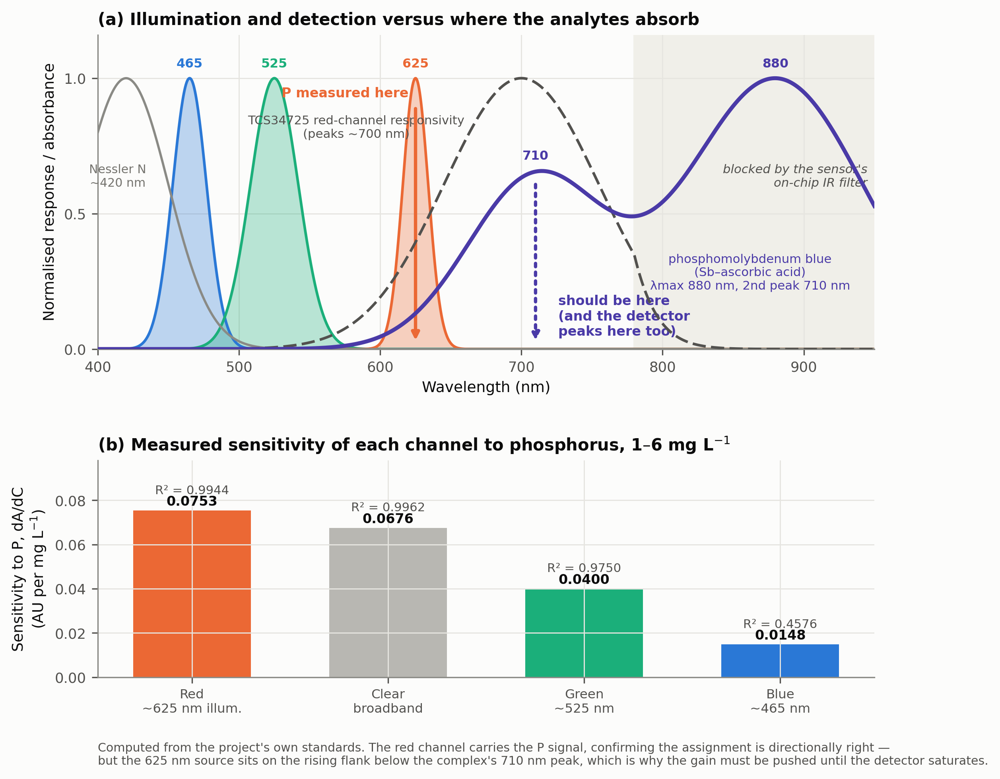

# รายงานการตรวจสอบความสอดคล้องของความยาวคลื่นกับสารที่วิเคราะห์

**ผู้จัดทำ** ชีวะ ทัศนา สาขาวิชาดิจิทัลการเกษตรและสิ่งแวดล้อม คณะวิทยาศาสตร์และเทคโนโลยี มหาวิทยาลัยราชภัฏรำไพพรรณี
**วันที่** 15 กันยายน 2569
**ไฟล์ที่ตรวจ** `firmware/Calibration_Engine.h`, `Spectrum_Engine.h`, `npk_calibration_matrices.h`, `phosphorus_q1_models.h`, `TinyML_Model.h`, `train_tinyml_model.py`, `spectrometer_npk2026.ino`
**ข้อมูลที่ใช้ยืนยัน** `data/phosphorus_1_10_reagent_kinetics.csv`, `data/master_chemical_standards.csv`

---

## 1. คำตอบโดยสรุป

| ธาตุ | วิธีสร้างสี | ความยาวคลื่นดูดกลืนจริง | เฟิร์มแวร์ใช้ | ผลการตรวจ |
| :--- | :--- | :--- | :--- | :--- |
| ไนโตรเจน | Nessler | ~420 nm | 465 nm (น้ำเงิน) | **ยอมรับได้** ใกล้เคียงที่สุดเท่าที่ฮาร์ดแวร์ทำได้ |
| ฟอสฟอรัส | Molybdenum blue (Sb–ascorbic) | **880 nm** (ยอดหลัก) และ **710 nm** (ยอดรอง) | 625 nm (แดง) | **ไม่เหมาะสม** ต่ำกว่ายอดรองถึง 85 nm — เป็นสาเหตุรากของการอิ่มตัวที่ 6 mg/L |
| โพแทสเซียม | Tetraphenylborate turbidimetry | การกระเจิงแสง แรงที่สุดที่ความยาวคลื่นสั้น (~420 nm) | 625 nm (แดง) | **แย่ที่สุดในห้าแบนด์** เลือกความยาวคลื่นที่ให้สัญญาณต่ำที่สุด |

ข้อสรุปหลัก **การเลือกความยาวคลื่นสำหรับฟอสฟอรัสเป็นสาเหตุรากของปัญหาการอิ่มตัวที่รายงานไว้ก่อนหน้า** ไม่ใช่การหมดสภาพของตัวทำปฏิกิริยา เมื่อวัดห่างจากยอดการดูดกลืนแสง สัมประสิทธิ์การดูดกลืนแสงโมลาร์ต่ำ จึงต้องเร่งอัตราขยายจนตัวตรวจวัดหมดช่วงพลวัตที่ 6 mg/L ส่วนโพแทสเซียมนั้นนอกจากเลือกความยาวคลื่นผิดแล้ว **ยังไม่มีข้อมูลการทดลองรองรับแม้แต่จุดเดียวในโครงการทั้งหมด**



**ภาพที่ 6** (ก) แถบการเปล่งแสงของหลอด RGB ทั้งสาม (465, 525, 625 nm) เทียบกับการตอบสนองของเซนเซอร์ TCS34725 ช่องสีแดง (ยอดที่ ~700 nm) และสเปกตรัมการดูดกลืนแสงของสารเชิงซ้อนฟอสโฟโมลิบดีนัมบลู (ยอดหลัก 880 nm ยอดรอง 710 nm) ลูกศรสีส้มคือตำแหน่งที่วัดจริง ลูกศรสีม่วงคือตำแหน่งที่ควรวัด (ข) ความไวต่อฟอสฟอรัสของแต่ละช่องสัญญาณ คำนวณจากสารละลายมาตรฐานของโครงการเอง

---

## 2. หลักฐานทางเคมีวิเคราะห์

### 2.1 ฟอสฟอรัส — ยอดการดูดกลืนแสงอยู่ที่ 880 nm และ 710 nm

สารทำปฏิกิริยาที่โครงการใช้ (หัวข้อ 3.2 ของต้นฉบับ) ประกอบด้วยแอมโมเนียมโมลิบเดต กรดแอสคอร์บิก และ**โพแทสเซียมแอนติโมนิลทาร์เทรต** ซึ่งเป็นสูตรของ Murphy และ Riley [1] สารเชิงซ้อนที่เกิดขึ้นคือ Sb-phosphomolybdenum blue

Nagul และคณะ [3] รายงานสเปกตรัมของผลิตภัณฑ์จากวิธีที่ใช้แอนติโมนีไว้ชัดเจนว่า

> "absorption maximum at ca. 880 nm, with a distinct second peak at 710 nm"
> ค่าสัมประสิทธิ์การดูดกลืนแสงโมลาร์ที่ 880 nm คือ ε ≈ 26,000 L mol⁻¹ cm⁻¹

Miller และ Arai [6] ยืนยันในบริบทของสารสกัดดินโดยเฉพาะว่าความยาวคลื่นที่เหมาะสมที่สุดอยู่ที่ 886 – 888 nm

**ที่ 625 nm สารเชิงซ้อนอยู่บนไหล่ขาขึ้นก่อนถึงยอดรอง 710 nm** ไม่ใช่ที่ยอด การวัดจึงได้สัมประสิทธิ์การดูดกลืนแสงที่ต่ำกว่าศักยภาพของวิธีอย่างมีนัยสำคัญ

### 2.2 ข้อมูลของโครงการเองยืนยันข้อสรุปนี้

ความไวของแต่ละช่องสัญญาณต่อฟอสฟอรัส คำนวณจากช่วงเชิงเส้น 1.0 – 6.0 mg/L

| ช่องสัญญาณ | แหล่งกำเนิดแสง | ความชัน $dA/dC$ (AU per mg/L) | $R^2$ | สัมพัทธ์ |
| :--- | :--- | :---: | :---: | :---: |
| Red | ~625 nm | **0.0753** | 0.9944 | 100% |
| Clear | แถบกว้าง | 0.0676 | 0.9962 | 89.7% |
| Green | ~525 nm | 0.0400 | 0.9750 | 53.2% |
| Blue | ~465 nm | 0.0148 | 0.4576 | 19.6% |

การที่ช่องสีแดงให้ความไวสูงสุดยืนยันว่า **ทิศทางการเลือกช่องสัญญาณถูกต้อง** (สารสีน้ำเงินดูดกลืนแสงสีแดง) แต่ความชันสัมบูรณ์เพียง 0.0753 AU per mg/L หมายความว่าที่ความเข้มข้น 6 mg/L สัญญาณรวมยังไม่ถึง 0.50 AU ทั้งที่สารเชิงซ้อนโมลิบดีนัมบลูที่ความเข้มข้นนี้ควรให้ค่าการดูดกลืนแสงเกิน 1.0 AU เมื่อวัดที่ 880 nm ในคิวเวตต์ 10 mm

### 2.3 ทางออกที่เหมาะสมที่สุดคือ 700 – 720 nm ไม่ใช่ 880 nm

ข้อค้นพบสำคัญจากการอ่านดาต้าชีตของเซนเซอร์

| องค์ประกอบ | ข้อเท็จจริง | นัย |
| :--- | :--- | :--- |
| ตัวตรวจวัด TCS34725 ช่องสีแดง | ยอดการตอบสนองอยู่ที่ **~700 nm** และยังตอบสนอง ~95% ที่ 625 nm | ตัวตรวจวัดพร้อมอยู่แล้วสำหรับ 700 nm |
| ตัวตรวจวัด TCS34725 ตัวกรอง IR | มีตัวกรองตัดอินฟราเรดฝังบนชิป ("An IR blocking filter, integrated on-chip") | **880 nm เข้าไม่ถึงในทางกายภาพ** ต่อให้เปลี่ยนหลอด |
| หลอด NeoPixel ไดแดง | เปล่งแสงที่ ~620 – 630 nm ไม่มีการเปล่งแสงที่ 700 nm | **หลอดคือคอขวด ไม่ใช่เซนเซอร์** |

ดังนั้นข้อเสนอที่ถูกต้องคือ **เปลี่ยนแหล่งกำเนิดแสงของช่องฟอสฟอรัสจากไดแดงของ NeoPixel เป็นหลอดเดี่ยวที่ 700 – 720 nm** ซึ่งจะได้ประโยชน์สองทางพร้อมกัน คือตรงกับยอดรอง 710 nm ของสารเชิงซ้อน และตรงกับยอดการตอบสนองของเซนเซอร์เดิมพอดี โดยไม่ต้องเปลี่ยนเซนเซอร์

การไปที่ 880 nm ต้องเปลี่ยนทั้งหลอดและตัวตรวจวัด (ต้องใช้โฟโตไดโอดที่ไม่มีตัวกรอง IR) ซึ่งเป็นการออกแบบใหม่ทั้งระบบ

### 2.4 โพแทสเซียม — 625 nm คือตัวเลือกที่แย่ที่สุดในห้าแบนด์

การวัดโพแทสเซียมด้วยโซเดียมเตตราฟีนิลบอเรตอาศัย **การกระเจิงแสงจากตะกอนแขวนลอย (turbidimetry)** ไม่ใช่การดูดกลืนแสงของสารที่มีสี ตะกอนโพแทสเซียมเตตราฟีนิลบอเรตไม่มีสี จึงไม่มีโครโมฟอร์ให้ดูดกลืน

ความแรงของการกระเจิงแปรผกผันกับความยาวคลื่นอย่างรุนแรง ในขีดจำกัดเรย์ลีห์ $I \propto \lambda^{-4}$

| ความยาวคลื่น | สัญญาณสัมพัทธ์เทียบ 625 nm (ขีดจำกัดเรย์ลีห์) |
| :--- | :---: |
| 420 nm (ความยาวคลื่นมาตรฐานของวิธี) | 4.90 เท่า |
| 465 nm | 3.26 เท่า |
| 525 nm | 2.01 เท่า |
| **625 nm (ที่เฟิร์มแวร์ใช้)** | **1.00 เท่า** |

**ข้อควรระวังทางวิชาการ** ตะกอนเตตราฟีนิลบอเรตมักมีขนาดระดับไมโครเมตร ซึ่งอยู่ในบริเวณการกระเจิงแบบไม (Mie) ที่การขึ้นกับความยาวคลื่นอ่อนกว่าเรย์ลีห์มาก (ประมาณ $\lambda^{-1}$ ถึง $\lambda^{-2}$) อัตราส่วนที่ได้จริงจึงน่าจะอยู่ระหว่าง 1.4 ถึง 3.3 เท่า ไม่ใช่ 3.26 เท่าเต็ม แต่ **ทิศทางยังคงเดิมและชัดเจน คือความยาวคลื่นสั้นให้สัญญาณดีกว่าเสมอ** และ 625 nm เป็นตัวเลือกที่แย่ที่สุดในบรรดาความยาวคลื่นที่ฮาร์ดแวร์ผลิตได้

### 2.5 ไนโตรเจน — เหมาะสมเท่าที่ฮาร์ดแวร์ทำได้

สารเชิงซ้อนจากปฏิกิริยา Nessler มีสีเหลืองถึงน้ำตาล ยอดการดูดกลืนแสงประมาณ 420 – 425 nm ช่องสีน้ำเงินของ TCS34725 มียอดที่ 465 nm และยังตอบสนองได้ถึงประมาณ 420 nm การเลือกแบนด์ 465 nm จึงเป็นตัวเลือกที่ดีที่สุดในสามไดของหลอด RGB

นอกจากนี้ยังพบว่า **`predict_nitrogen_autorun()` ใช้วิธีที่ถูกหลักการ** คือเมื่อความเข้มข้นสูงเกิน 10 mg/L จะสลับไปใช้ช่องสีเขียวซึ่งมีสัมประสิทธิ์การดูดกลืนแสงต่ำกว่า เพื่อขยายช่วงใช้งานโดยไม่ให้ตัวตรวจวัดอิ่มตัว นี่คือเทคนิคมาตรฐานของเคมีวิเคราะห์ที่ใช้ได้ถูกต้อง **และเป็นเทคนิคเดียวกับที่ควรนำมาใช้กับฟอสฟอรัสแต่ยังไม่ได้ใช้**

---

## 3. ข้อบกพร่องที่พบในโค้ด

### W1 ฟอสฟอรัสถูกกำหนดช่องสัญญาณขัดแย้งกัน 4 แบบในเฟิร์มแวร์ชุดเดียวกัน

| ตำแหน่งในโค้ด | ช่องสัญญาณที่ใช้กับฟอสฟอรัส |
| :--- | :--- |
| `Calibration_Engine.h:59` (คอมเมนต์โครงสร้าง) | "625 nm Red / Molybdenum Blue" |
| `Calibration_Engine.h:167` (ค่าเริ่มต้น) | "Phosphorus Default Curve (**Green 525 nm**)" |
| `Calibration_Engine.h:354` (ปุ่มบนหน้าจอ) | "[Btn B: **P-525**]" |
| `spectrometer_npk2026.ino:1562` (โหมด POLY) | `valP = calcP_Poly(gg)` ใช้สัดส่วน**เขียว** |
| `spectrometer_npk2026.ino:1588` (โหมด SOTA) | `calculateConcentration_SC(A_red, curveP)` ใช้**แดง** |

**ผลกระทบร้ายแรง** ผู้ใช้ที่ทำการสอบเทียบตามคำแนะนำบนหน้าจอจะสอบเทียบที่ 525 nm (เขียว) แต่โค้ดนำเส้นโค้งที่ได้ไปใช้กับค่าการดูดกลืนแสงของช่อง**แดง** ความชันต่างกัน 1.9 เท่า (0.0753 เทียบ 0.0400) ผลลัพธ์จะคลาดเคลื่อนเป็นระบบประมาณ 88%

### W2 โพแทสเซียมและฟอสฟอรัสอ่านจากตัวเลขเดียวกัน

```c
valP = calculateConcentration_SC(A_red, curveP);   // บรรทัด 1588
valK = calculateConcentration_SC(A_red, curveK);   // บรรทัด 1594
```

ทั้งสองธาตุถูกคำนวณจาก `A_red` ตัวเดียวกัน ต่างกันเพียงสัมประสิทธิ์ของเส้นโค้ง **หนึ่งสมการกับสองตัวแปรที่ไม่ทราบค่า คือระบบที่หาคำตอบไม่ได้ (underdetermined)** ถ้าตัวอย่างมีทั้ง P และ K ค่าที่รายงานทั้งสองจะผิดทั้งคู่ และไม่มีทางแยกแยะได้ว่าสัญญาณที่วัดได้มาจากธาตุใด

การแยกสองธาตุนี้ต้องใช้ความยาวคลื่นที่ต่างกัน ซึ่งเป็นอีกเหตุผลหนึ่งที่ต้องย้าย K ไปที่ 465 nm

### W3 "สเปกตรัม 5 แบนด์" มีข้อมูลอิสระเพียง 3 มิติ

`Spectrum_Engine.h` อ้างว่ากวาดแสง 5 ความยาวคลื่น แต่หลอด NeoPixel มีได (die) เปล่งแสงเพียง 3 ตัว การสร้างแบนด์ 500 nm และ 590 nm ทำโดยผสมสีและอ่านค่าเฉลี่ยของช่องอื่น

```c
case 1: rawSig = ((float)b + (float)g) * 0.5f; break; // "Cyan 500 nm"
case 3: rawSig = ((float)r + (float)g) * 0.5f; break; // "Yellow 590 nm"
```

เมื่อเขียนเป็นเมทริกซ์การแปลงจาก $(r, g, b)$ ไปเป็น 5 แบนด์ จะได้ **rank = 3** ไม่ใช่ 5

ในเชิงฟิสิกส์ หลอด RGB ที่ตั้งค่า `{0,190,255}` ไม่ได้เปล่งแสงความยาวคลื่น 500 nm แต่เปล่งแสงสองยอดพร้อมกันที่ 465 nm และ 525 nm โดยมี**หลุม**อยู่ตรงกลางที่ 500 nm พอดี เช่นเดียวกับ `{255,200,0}` ที่เปล่งแสงที่ 525 nm และ 625 nm โดยไม่มีการเปล่งแสงที่ 590 nm เลย

**ผลกระทบ** ค่า `peakWavelength` ที่เครื่องรายงานไม่มีความหมายทางกายภาพ และแกน x ของกราฟสเปกตรัมบนหน้าจอ (420 – 660 nm) สื่อความเข้าใจผิดว่าเป็นการกวาดสเปกตรัมจริง

### W4 ค่าอ้างอิงสัญญาณเปล่า (blank) เป็นค่าที่กำหนดตายตัว ไม่ได้มาจากการวัด

```c
calibState.blankIntensity[0] = 3850.0f; // 465 nm
...
calibState.blankIntensity[4] = 4300.0f; // 625 nm
calibState.isCalibrated = true;          // <-- ตั้งเป็น true ทันที
```

เครื่องรายงานสถานะว่าสอบเทียบแล้วตั้งแต่เปิดเครื่อง โดยที่ยังไม่เคยวัดน้ำกลั่นเลย ค่าการดูดกลืนแสงทุกค่าที่คำนวณก่อนผู้ใช้กดสอบเทียบจึงอ้างอิงกับตัวเลขสมมติ

เช่นเดียวกัน เส้นโค้งมาตรฐานเริ่มต้นของ N, P และ K ทั้งหมด (`curveN.absorbances[]`, `curveP.absorbances[]`, `curveK.absorbances[]`) เป็นค่าที่กำหนดในโค้ด ไม่ตรงกับไฟล์ข้อมูลใดในโครงการ

### W5 เกณฑ์สลับ tier ไม่ต่อเนื่อง และ tier 3 แทบไม่ถูกเรียกใช้

จาก `npk_calibration_matrices.h`

| จุดสลับ | tier ก่อนหน้าให้ | tier ถัดไปให้ | ความไม่ต่อเนื่อง |
| :--- | :---: | :---: | :---: |
| $A = 0.230$ (tier 1 → 2) | 1.334 mg/L | 2.190 mg/L | **0.856 mg/L** |
| $A = 0.510$ (tier 2 → 3) | 7.324 mg/L | 8.5 mg/L | 1.2 mg/L |

เกณฑ์ $A = 0.230$ ถูกอธิบายในคอมเมนต์ว่า "Transition point at ~1.0 mg/L" แต่สมการ tier 1 ให้ค่า 1.334 mg/L ณ จุดนั้น

ยิ่งกว่านั้น ค่าการดูดกลืนแสงสูงสุดที่วัดได้จริงในโครงการคือ 0.5082 AU ซึ่ง **ต่ำกว่าเกณฑ์ 0.510** จึงไม่มีตัวอย่างใดเข้าถึงสาขา tier 3 (semi-log สำหรับ 10 – 1000 mg/L) ได้เลย โค้ดส่วนนั้นเป็น dead branch ในทางปฏิบัติ

เมื่อรันสารละลายมาตรฐานทั้งหกผ่าน `predict_phosphorus_autorun()` ได้ RMSE = 1.332 mg/L โดยที่ตัวอย่าง 2.0 mg/L ถูกรายงานเป็น 1.000 mg/L (ติดขอบล่างของ clamp)

### W6 ค่าคงที่ tier 1 ของฟอสฟอรัสมาจากการฟิตที่รวมจุดผิดปกติ

| ชุดข้อมูลที่ใช้ฟิต | slope | intercept | $R^2$ |
| :--- | :---: | :---: | :---: |
| 0.0 – 0.8 mg/L (ไม่รวมจุด 1.0) | 0.23450 | 0.00280 | **0.9990** |
| 0.0 – 1.0 mg/L (รวมจุด 1.0) | 0.15424 | 0.02420 | **0.7340** |
| ค่าใน `PHOSPHORUS_R0_1_*` | 0.15424 | 0.02420 | 0.7340 |

ค่าในเฟิร์มแวร์ตรงกับการฟิตที่ **รวม** จุด 1.0 mg/L ซึ่งเป็นจุดที่เก็บภายใต้เงื่อนไขอัตราขยายคนละค่า (ให้ค่า 0.1249 AU ต่ำกว่าจุด 0.8 mg/L ที่ได้ 0.188 AU) การรวมจุดนี้ทำให้ $R^2$ ตกจาก 0.999 เหลือ 0.734 และความชันผิดไป 34%

คอมเมนต์ในโค้ดเขียนว่า "Ultra-High Precision (R2 = 0.7340)" ซึ่งขัดแย้งกันในตัวเอง — $R^2 = 0.734$ ไม่ใช่ความแม่นยำสูง

### W7 สัมประสิทธิ์ชดเชยความขุ่นไม่ตรงกันระหว่างไฟล์

| ไฟล์ | ค่า $\alpha$ |
| :--- | :--- |
| `npk_calibration_matrices.h` | `a_clear * 0.15f` |
| ต้นฉบับ Q1 แบบจำลองที่ 3 | $\alpha = 0.40$ |

ทั้งสองค่าไม่ได้มาจากการหาค่าเหมาะที่สุดจากข้อมูล และในเชิงหลักการ การลบ $0.15 \times A_{\text{clear}}$ ออกจาก $A_{\text{red}}$ มีปัญหา เพราะช่องสัญญาณ clear เป็นผลรวมแถบกว้างที่ **มีสัญญาณของสารที่วิเคราะห์อยู่ด้วย** การลบจึงกำจัดสัญญาณจริงบางส่วนไปพร้อมกับความขุ่น

### W8 เกณฑ์เตือนการอิ่มตัวตั้งไว้สูงเกินกว่าจะทำงาน

`Spectrum_Engine.h` เตือนเมื่อ $A > 1.50$ และ clamp ที่ 2.50 แต่จากข้อมูลจริง ระบบนี้อิ่มตัวที่ $A \approx 0.51$ เกณฑ์ที่ตั้งไว้จึง **ไม่มีทางทำงาน** ในโหมดการใช้งานจริง เกณฑ์ 1.50 เป็นค่าทั่วไปของเครื่องสเปกโตรโฟโตมิเตอร์ตั้งโต๊ะ ไม่ใช่ของเครื่องนี้

### W9 หน่วยที่แสดงผลไม่ตรงกับหน่วยที่แบบจำลองคำนวณ

หน้าจอฟอสฟอรัสแสดงผลเป็น **mg/kg** และเทียบกับเกณฑ์ Bray II (< 15, 15 – 35, > 35 mg/kg) พร้อมให้คำแนะนำการใส่ปุ๋ย แต่ `predict_phosphorus_autorun()` สอบเทียบด้วยสารละลายมาตรฐานหน่วย **mg/L ในสารสกัด** และไม่พบการแปลงหน่วยด้วยอัตราส่วนดินต่อสารสกัดที่ใดในโค้ด

ตัวเลขที่แสดงจึงเป็นความเข้มข้นในสารละลายที่ถูกติดป้ายว่าเป็นความเข้มข้นในดิน แล้วนำไปเทียบเกณฑ์ที่ใช้หน่วยคนละอย่าง คำแนะนำการใส่ปุ๋ยที่ตามมาจึงไม่มีฐานรองรับ

### W10 แบบจำลอง TinyML ฝึกด้วยข้อมูลสุ่มทั้งหมด

`train_tinyml_model.py` สร้างชุดข้อมูลฝึกด้วยตัวสร้างเลขสุ่ม

```python
K_true = np.random.uniform(5.0, 300.0, num_samples)
turbidity = np.random.uniform(0.05, 0.35, num_samples)
r_resp = 40.0 + 0.26*K_true - 0.00025*(K_true**2) + 15.0*turbidity + np.random.normal(0, 0.9, ...)
```

โครงข่ายประสาทเทียมที่ฝังใน `TinyML_Model.h` **ไม่เคยเห็นค่าที่วัดจากเครื่องจริงเลย** ค่า $R^2$ ที่สคริปต์พิมพ์ออกมาคือ $R^2$ เทียบกับสมการสุ่มที่ตัวมันเองสร้างขึ้น ไม่ใช่สมรรถนะการวัด การนำเสนอใน `README.md` ว่าเป็น "TinyML Deep Neural Net" ของเครื่องวัดจึงสื่อความเข้าใจผิด

**และเนื่องจากไม่มีข้อมูลโพแทสเซียมจริงในโครงการเลย** (ตรวจแล้ว `master_chemical_standards.csv` มีเฉพาะ Nitrogen 16 แถว และ Phosphorus 13 แถว) เอาต์พุตช่อง K ของแบบจำลองนี้จึงไม่มีฐานเชิงประจักษ์ใดๆ รองรับ

### W11 คอมเมนต์ในโค้ดระบุข้อเท็จจริงทางเคมีผิด

```c
// spectrometer_npk2026.ino:1178
// Phosphorus Assay: 625 nm Red LED (Molybdenum Blue Complex max absorption)
```

ยอดการดูดกลืนแสงสูงสุดของสารเชิงซ้อนโมลิบดีนัมบลูอยู่ที่ 880 nm ไม่ใช่ 625 nm คอมเมนต์นี้ทำให้ผู้พัฒนาคนถัดไปเข้าใจว่าการเลือกความยาวคลื่นนี้ผ่านการพิจารณาทางเคมีมาแล้ว ทั้งที่ไม่ใช่

---

## 4. ข้อเสนอการแก้ไข

### 4.1 ฮาร์ดแวร์ (ลำดับความสำคัญสูงสุด)

1. **เพิ่มหลอด LED เดี่ยวที่ 700 – 720 nm สำหรับช่องฟอสฟอรัส** เป็นการแก้ที่ต้นเหตุ ต้นทุนต่ำ ไม่ต้องเปลี่ยนเซนเซอร์ และได้ประโยชน์สองทางคือตรงยอดรอง 710 nm ของสารเชิงซ้อน และตรงยอดการตอบสนองของ TCS34725 พอดี คาดว่าจะเพิ่มความไวและเลื่อนจุดอิ่มตัวขึ้นไปเหนือ 10 mg/L
2. **ย้ายการวัดโพแทสเซียมไปที่ไดน้ำเงิน 465 nm** ตามหลักการกระเจิงแสง หรือเพิ่มหลอด 420 nm หากต้องการตรงมาตรฐานสากล การย้ายนี้ยังแก้ปัญหา W2 ไปพร้อมกัน เพราะ P กับ K จะไม่อ่านจากช่องเดียวกันอีกต่อไป
3. **ไนโตรเจนไม่ต้องแก้** 465 nm เหมาะสมแล้ว หากต้องการปรับปรุงเพิ่มเติมจึงค่อยพิจารณาหลอด 420 nm

### 4.2 เฟิร์มแวร์

4. **แก้ความขัดแย้งของช่องสัญญาณฟอสฟอรัสให้เหลือค่าเดียว** กำหนดค่าคงที่กลาง เช่น `#define P_CHANNEL CHANNEL_RED` แล้วอ้างอิงจากที่เดียวทั้งในตัวช่วยสอบเทียบ ข้อความบนหน้าจอ และทุกเส้นทางการทำนาย
5. **ปรับปรุงเทคนิคหลายช่วงคลื่นแบบเดียวกับไนโตรเจนมาใช้กับฟอสฟอรัส** เมื่อมีหลอด 710 nm แล้ว ให้ใช้ 710 nm สำหรับช่วงต่ำ (ความไวสูง) และสลับไป 625 nm สำหรับช่วงสูง (ความไวต่ำกว่า ขยายช่วงได้) ซึ่งเป็นการใช้หลักการที่โครงการทำถูกอยู่แล้วกับไนโตรเจน
6. **เลิกอ้างว่ากวาดสเปกตรัม 5 แบนด์** ปรับ `Spectrum_Engine.h` ให้รายงานตามความจริง 3 แบนด์ (465, 525, 625 nm) หรือหากต้องการ 5 แบนด์จริง ต้องเปลี่ยนไปใช้เซนเซอร์สเปกตรัมหลายช่อง เช่น AS7341 ที่มีตัวกรองแบบอินเทอร์เฟอเรนซ์ 8 ช่องจริง
7. **ลบค่า blank ที่กำหนดตายตัวออก** ตั้ง `isCalibrated = false` จนกว่าผู้ใช้จะวัดน้ำกลั่นจริง และไม่แสดงค่าความเข้มข้นใดๆ ก่อนหน้านั้น
8. **แก้เกณฑ์สลับ tier ให้ต่อเนื่อง** คำนวณจุดสลับจากสมการโดยตรงแทนการกำหนดตัวเลขด้วยมือ และแก้ค่า `PHOSPHORUS_R0_1_*` โดยฟิตใหม่จากชุด 0.0 – 0.8 mg/L เท่านั้น
9. **ตั้งเกณฑ์เตือนการอิ่มตัวจากข้อมูลจริง** ใช้ค่าประมาณ $A > 0.50$ สำหรับช่องแดงที่ 625 nm แทน 1.50 และวัดใหม่หลังเปลี่ยนหลอด
10. **แก้หน่วยให้ตรงกัน** แสดงผลเป็น mg/L ในสารสกัด หรือเพิ่มพารามิเตอร์อัตราส่วนดินต่อสารสกัดให้ผู้ใช้ตั้งค่า แล้วค่อยแปลงเป็น mg/kg พร้อมแสดงสูตรที่ใช้
11. **ระงับเอาต์พุตโพแทสเซียมทั้งหมดไว้ก่อน** จนกว่าจะมีข้อมูลสอบเทียบจริง หรือติดป้ายให้ชัดเจนว่าเป็นค่าสาธิต
12. **แก้ป้าย TinyML** ระบุในเอกสารและหน้าจอว่าแบบจำลองนี้ฝึกด้วยข้อมูลจำลอง จนกว่าจะฝึกใหม่ด้วยข้อมูลที่วัดจริง

### 4.3 การทดลองที่ควรทำเพื่อยืนยัน

13. วัดสเปกตรัมการดูดกลืนแสงของสารเชิงซ้อนที่โครงการเตรียมเอง ด้วยเครื่อง UV-Vis ตั้งโต๊ะในช่วง 400 – 900 nm เพื่อยืนยันตำแหน่งยอด 710 nm และ 880 nm ของสูตรสารทำปฏิกิริยาที่ใช้จริง
14. เปรียบเทียบความไวของเครื่องต้นแบบก่อนและหลังเปลี่ยนหลอดเป็น 710 nm ด้วยสารละลายมาตรฐานชุดเดียวกัน รายงานความชัน $dA/dC$ และตำแหน่งจุดอิ่มตัวของทั้งสองกรณี

---

## เอกสารอ้างอิง

[1] J. Murphy and J. P. Riley, "A modified single solution method for the determination of phosphate in natural waters," *Analytica Chimica Acta*, vol. 27, pp. 31–36, 1962. doi: 10.1016/S0003-2670(00)88444-5

[3] E. A. Nagul, I. D. McKelvie, P. Worsfold, and S. D. Kolev, "The molybdenum blue reaction for the determination of orthophosphate revisited: Opening the black box," *Analytica Chimica Acta*, vol. 890, pp. 60–82, 2015. doi: 10.1016/j.aca.2015.07.030

[6] A. P. Miller and Y. Arai, "Comparative evaluation of phosphate spectrophotometric methods in soil test phosphorus extracting solutions," *Soil Science Society of America Journal*, vol. 80, no. 6, pp. 1543–1550, 2016. doi: 10.2136/sssaj2016.08.0256n

[10] ams-OSRAM, *TCS3472 Color Light-to-Digital Converter with IR Filter*, Datasheet TAOS135, August 2012.

หมายเลขอ้างอิงตรงกับรายการใน `2026-09-15-manuscript-phosphorus-q1-revised.md`
