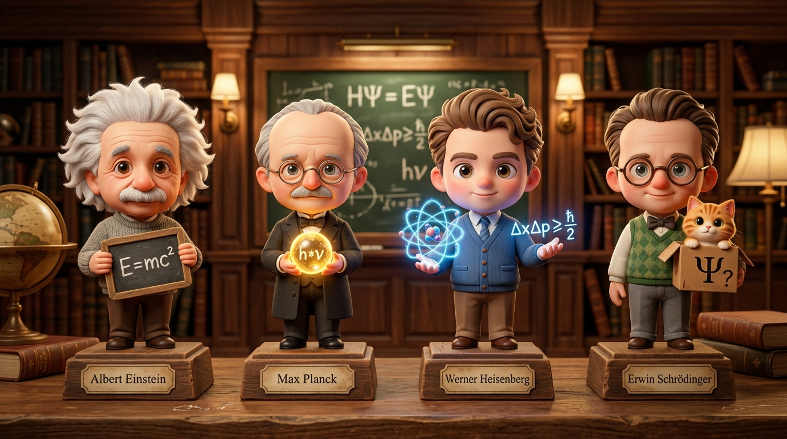
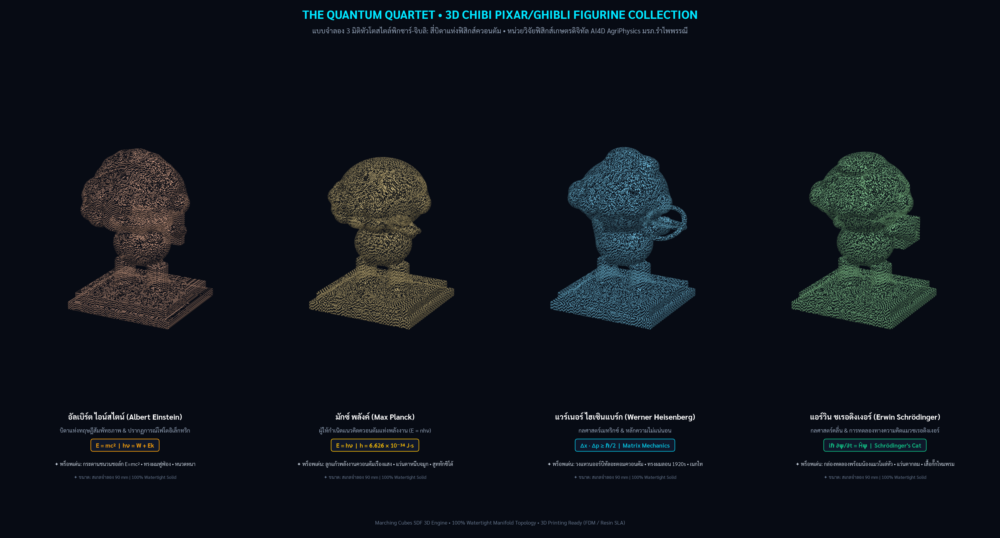

# ⚛️ The Quantum Quartet • 3D Chibi Collection (Pixar / Ghibli Style)
### ชุดแบบจำลอง 3 มิติหัวโตสไตล์พิกซาร์-จิบลิ: สี่บิดาแห่งฟิสิกส์ควอนตัม
**Albert Einstein • Max Planck • Werner Heisenberg • Erwin Schrödinger**
**สังกัด:** หน่วยวิจัยฟิสิกส์เกษตรดิจิทัลและปัญญาประดิษฐ์ (AI4D AgriPhysics) สาขาวิชาฟิสิกส์ คณะวิทยาศาสตร์และเทคโนโลยี มหาวิทยาลัยราชภัฏรำไพพรรณี

---

## 📌 ภาพรวมโครงการ (Project Overview)

โครงการนี้ออกแบบและสร้างสรรค์ชุดแบบจำลอง 3 มิติเต็มตัว (Full-Body Chibi Figurines) ในอัตราส่วนหัวโตสไตล์แอนิเมชันระดับโลก **Pixar Animation Studios & Studio Ghibli** เพื่อถ่ายทอดเรื่องราว ประวัติศาสตร์ และสมการเอกลักษณ์ของ 4 เสาหลักผู้ให้กำเนิดกลศาสตร์ควอนตัมและฟิสิกส์ยุคใหม่:
1. **อัลเบิร์ต ไอน์สไตน์ (Albert Einstein)**
2. **มักซ์ พลังค์ (Max Planck)**
3. **แวร์เนอร์ ไฮเซินแบร์ก (Werner Heisenberg)**
4. **แอร์วิน ชเรอดิงเงอร์ (Erwin Schrödinger & His Cat)**

โครงสร้างโมเดลสร้างขึ้นด้วยระบบคณิตศาสตร์ **Vectorized Signed Distance Fields (SDF)** และอัลกอริทึม **Marching Cubes** การันตีโครงสร้างตาข่ายสามเหลี่ยมเนื้อตันสมบูรณ์แบบ **100% Watertight Manifold (ขอบเปิด Boundary Edges = 0)** พร้อมพิมพ์ 3 มิติ (3D Printing Ready) ทุกระบบ ทั้ง FDM/FFF และ SLA/Resin



---

## 🧑‍🔬 รายละเอียดตัวละครและสมการเอกลักษณ์ (Character Profiles)

| ตัวละคร (Physicist) | สไตล์การออกแบบ (Pixar/Ghibli Chibi) | พร็อพเอกลักษณ์ประจำตัว (Signature Prop) | สมการก้องโลก (Signature Formula) |
| :--- | :--- | :--- | :--- |
| **Albert Einstein**<br>*(1879–1955)* | หัวโตแก้มป่อง ทรงผมฟูฟ่องสีขาวนุ่มฟู หนวดหนาอบอุ่น สวมสเวตเตอร์ไหมพรมถัก | **กระดานชนวนชอล์ก E=mc²**<br>สองมือโอบกระดานไม้สีชอล์กอย่างภาคภูมิใจ | $$E = mc^2$$<br>$$h\nu = W + E_k$$ *(Nobel 1921)* |
| **Max Planck**<br>*(1858–1947)* | สุภาพบุรุษนักฟิสิกส์เยอรมัน หน้าผากกว้าง แว่นตาหนีบจมูก (Pince-Nez) สูททักซิโด้ติดหูกระต่าย | **ลูกแก้วพลังงานควอนตัม (hν)**<br>ลูกแก้วเรืองแสงสีทองอร่ามพร้อมวงแหวนพลังงานหมุนวน | $$E = nh\nu$$<br>$$h = 6.626 \times 10^{-34}\text{ J}\cdot\text{s}$$ *(Nobel 1918)* |
| **Werner Heisenberg**<br>*(1901–1976)* | นักทฤษฎีหนุ่มอัจฉริยะยุค 1920s ทรงผมลอนปัดข้างสุดเท่ สูทคอปกผูกเนกไทสุภาพ | **วงแหวนออร์บิทัลอะตอมควอนตัม**<br>มือขวายกชูแบบจำลองอะตอมพร้อมวงแหวนความน่าจะเป็น | $$\Delta x \cdot \Delta p \ge \frac{\hbar}{2}$$<br>Matrix Mechanics *(Nobel 1932)* |
| **Erwin Schrödinger**<br>*(1887–1961)* | ศาสตราจารย์เปี่ยมเสน่ห์ แว่นตากรอบกลม เสื้อกั๊กไหมพรมวินทจสีเขียวเหนี่ยวทรัพย์ | **กล่องทดลองและน้องแมวควอนตัม**<br>กล่องกระดาษที่มีน้องแมวสีส้มลายสลิดโผล่หัวหูตั้งเกาะขอบกล่อง | $$i\hbar \frac{\partial \psi}{\partial t} = \hat{H}\psi$$<br>Schrödinger's Cat *(Nobel 1933)* |



---

## 📁 โครงสร้างไฟล์ในโฟลเดอร์ (Directory Architecture)

```
models_3d/quantum_physicists_chibi/
├── README.md                          # เอกสารกำกับ คู่มือประวัติศาสตร์ และการพิมพ์ 3 มิติ (ไฟล์นี้)
├── quantum_physicists_chibi.scad      # ซอร์สโค้ดพารามิเตอร์ OpenSCAD (ปรับแต่งขนาดและโมดูลาร์ได้อิสระ)
├── einstein_chibi_3d.stl              # ไฟล์โมเดล 3D STL ไอน์สไตน์ (Watertight 100% | 143,180 Tris | 6.83 MB)
├── planck_chibi_3d.stl                # ไฟล์โมเดล 3D STL พลังค์ (Watertight 100% | 128,752 Tris | 6.14 MB)
├── heisenberg_chibi_3d.stl            # ไฟล์โมเดล 3D STL ไฮเซินแบร์ก (Watertight 100% | 132,700 Tris | 6.33 MB)
├── schrodinger_chibi_3d.stl           # ไฟล์โมเดล 3D STL ชเรอดิงเงอร์และน้องแมว (Watertight 100% | 132,048 Tris | 6.30 MB)
├── quantum_quartet_diorama_3d.stl     # ไฟล์โมเดล 3D STL รวม 4 บิดาควอนตัม (Watertight 100% | 290,830 Tris | 13.87 MB)
├── quantum_chibi_showcase.png         # ภาพพล็อตเปรียบเทียบเมช 3 มิติ 4 บิดาควอนตัมความละเอียดสูง
├── quantum_chibi_quartet.jpg          # ภาพเรนเดอร์คอนเซ็ปต์อาร์ต 3D Pixar/Ghibli สี่บิดาควอนตัม
└── quantum_chibi_viewer_3d.html       # เว็บแอป Three.js พรีวิว 3D ปรับสตูดิโอแสง สลับตัวละคร และการ์ดชีวประวัติ
```

---

## 🖨️ คำแนะนำการพิมพ์ 3 มิติ (3D Printing & Slicing Guide)

### 1. ขนาดโมเดลแนะนำ (Scale Guide)
* **สเกลตั้งโต๊ะสะสม (Default 1:1 Scale in CAD):** ความสูง $90 - 100\text{ mm}$ (ฐานกว้าง $52 \times 42\text{ mm}$) เหมาะกับการตั้งบนโต๊ะทำงาน แท่นจัดแสดง หรือโต๊ะทดลองฟิสิกส์
* **สเกลย่อส่วนพวงกุญแจ (Keyring Mini 50%):** ปรับลดเหลือ $50\text{ mm}$ ในโปรแกรม Slicer
* **สเกลใหญ่สำหรับงานจัดแสดง (Display Grade 150%):** ขยายเป็น $150\text{ mm}$ เพื่อความคมชัดสูงสุดของตัวอักษรบนกระดาน $E=mc^2$ และใบหน้าน้องแมว

### 2. การตั้งค่าเครื่องพิมพ์เส้นพลาสติก (FDM/FFF: Prusa, Bambu Lab, Creality)
- **Layer Height:** `0.12 mm` (แนะนำสำหรับงานสะสม) หรือ `0.16 mm`
- **Support:** เปิดใช้งาน **Tree Support (Organic)** ทำมุมโอเวอร์แฮงก์ > `48°` รองรับใต้คาง ใต้กล่อง/กระดาน และชายแขนเสื้อ แกะออกง่ายไม่ทิ้งรอย
- **Infill:** `15% - 20%` ลาย **Gyroid**
- **วัสดุ:** PLA+ สีหินอ่อน (Marble White), สีบรอนซ์ (Silk Gold), หรือสีขาวด้านสำหรับเพ้นท์สีโมเดล

### 3. การตั้งค่าเครื่องพิมพ์เรซิน (SLA/MSLA/DLP: Anycubic, Elegoo)
- **Layer Height:** `0.05 mm` (50 ไมครอน) หรือ `0.025 mm`
- **Orientation:** เอียงตัวโมเดลไปด้านหลังทำมุม $25^\circ - 30^\circ$ เทียบกับฐานพิมพ์
- **Supports:** ใช้ Light Supports บริเวณเส้นผมและกรอบแว่นตาตา, Medium Supports ใต้ฐาน Plinth

---

## 🌐 การใช้งาน WebGL 3D Interactive Viewer (`quantum_chibi_viewer_3d.html`)

สามารถเปิดดูและหมุนโมเดล 3 มิติแบบ 360 องศาได้ทั้งในคอมพิวเตอร์และมือถือ:
- **เปิดไฟล์โดยตรง:** ดับเบิลคลิกเปิด [`quantum_chibi_viewer_3d.html`](quantum_chibi_viewer_3d.html) หรือเปิดผ่าน [`../../web/quantum_chibi_viewer_3d.html`](../../web/quantum_chibi_viewer_3d.html)
- **สลับตัวละคร:** เลือกชมฟิกเกอร์เดี่ยวหรือไดโอรามาครบทีม 4 ท่าน
- **โหมดแสงสตูดิโอ 4 ธีม:**
  - 🎨 **Pixar Warm Studio:** แสงอบอุ่นนุ่มนวล เน้นผิวและเสื้อผ้าสไตล์ 3D Clay
  - 🌿 **Ghibli Sunlight:** แสงแดดยามบ่ายในทุ่งหญ้า สดใส ละมุนตา
  - ⚡ **Quantum Cyber:** แสงไฟนีออนฟ้า-ชมพูสไตล์ควอนตัมแล็บ
  - 🏛️ **Alabaster Marble:** แสงสตูดิโอสีขาวบริสุทธิ์โชว์สรีระรูปปั้นหินอ่อน
- **ปุ่มดาวน์โหลด:** โหลดไฟล์ `.stl` ของตัวละครที่กำลังเลือก, โค้ด `.scad`, และภาพคอนเซ็ปต์อาร์ตได้ทันที
