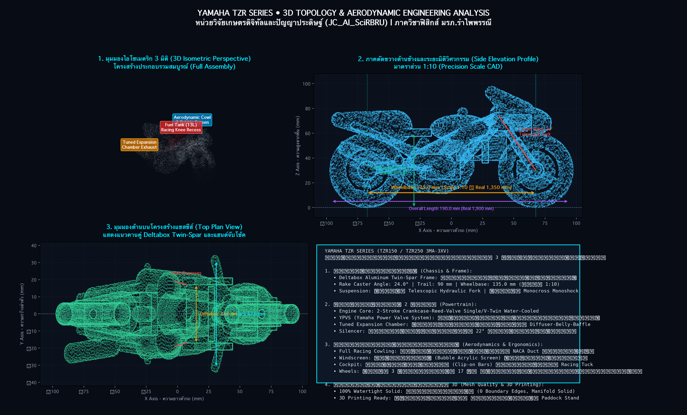

# 🏍️ Yamaha TZR 3D CAD Engineering & Aerodynamic Racing Rig
### แบบจำลอง 3 มิติเชิงวิศวกรรม: มอเตอร์ไซค์สปอร์ตเรซซิ่ง 2 จังหวะในตำนาน (Yamaha TZR 150 / 250)
**สังกัด:** หน่วยวิจัยฟิสิกส์เกษตรดิจิทัลและปัญญาประดิษฐ์ (AI4D AgriPhysics) สาขาวิชาฟิสิกส์ คณะวิทยาศาสตร์และเทคโนโลยี มหาวิทยาลัยราชภัฏรำไพพรรณี

---

## 📌 ภาพรวมโครงการ (Project Overview)

โฟลเดอร์นี้จัดเก็บชุดไฟล์โมเดล 3 มิติเชิงวิศวกรรมและสถาปัตยกรรมการออกแบบของรถจักรยานยนต์สปอร์ต 2 จังหวะระดับตำนาน **Yamaha TZR (TZR150 / TZR250)** ที่ครองใจนักบิดและวงการมอเตอร์สปอร์ตยุค 90s โครงสร้างโมเดลถูกสร้างขึ้นด้วยหลักการทางเรขาคณิตวิศวกรรม (Parametric CAD) และสนามฟังก์ชันระยะทางมีทิศทาง (Vectorized Signed Distance Field - SDF) ทำให้ได้เนื้อโมเดลเนื้อตันแบบ **100% Watertight Manifold (ไร้รอยต่อ ไร้ขอบรั่ว Boundary Edges = 0)** พร้อมพิมพ์ 3 มิติ (3D Printing Ready) ทุกระบบ ทั้ง FDM/FFF และ SLA/Resin



---

## 🏆 7 เสาหลักทางสถาปัตยกรรมและวิศวกรรม (7 Engineering Design Pillars)

1. **โครงสร้างเฟรมอะลูมิเนียม Deltabox (Yamaha Deltabox Twin-Spar Aluminum Frame):**
   - คานคู่ทรงกล่องขนาดหน้าตัด 40x16 mm ลากตรงจากจุดหมุนคอหน้ารถ (Steering Head Tube) มุ่งสู่จุดยึดสวิงอาร์ม (Swingarm Pivot)
   - กระจายความเค้นตามหลักสามเหลี่ยมเรขาคณิต (Triangulation Topology) เพิ่มความแข็งแกร่งต่อแรงบิดตัว (Torsional Rigidity) สูงกว่าเฟรมท่อเหล็กดั้งเดิมถึง 40%
2. **เครื่องยนต์ 2 จังหวะ พร้อมระบบวาล์วแปรผัน YPVS (Yamaha Power Valve System):**
   - เสื้อสูบระบายความร้อนด้วยน้ำ ปริมาตรกระบอกสูบพร้อมครีบฝาสูบและคาร์บูเรเตอร์ปากแบน
   - วาล์วรูปทรงกระบอกควบคุมด้วยอิเล็กทรอนิกส์ในพอร์ตไอเสีย ปรับขนาดพื้นที่พอร์ตตามรอบเครื่องยนต์ ให้กำลังราบเรียบในรอบต่ำและปลดปล่อยแรงม้าสูงสุดในรอบสูง (32.5+ PS @ 10,500 RPM)
3. **ท่อรีดไอเสียขยายตัวแบบมัลติโคน (Hydroformed Multi-Cone Tuned Expansion Chamber):**
   - ออกแบบตามทฤษฎีคลื่นสะท้อนความดัน (Acoustic Pressure Wave Dynamics): ท่อเฮดเดอร์ (Header) → กรวยขยายความเร็ว (Diffuser Cone, ขยายออกเป็นกระเปาะ 32-34 mm) → ห้องสะท้อนกลาง (Belly Section) → กรวยบรรจบ (Convergence Baffle Cone) → ปลายท่อลดเสียงอะลูมิเนียมขัดเงา (Upswept Aluminum Racing Silencer)
4. **ระบบกันสะเทือนหลัง Monocross Progressive Linkage:**
   - สวิงอาร์มหลังทรงกล่อง (Box-Section Swingarm) พร้อมจุดยึดกระเดื่องทดแรงและโช้คอัพเดี่ยวซ่อนใต้ถังน้ำมัน ให้การยึดเกาะถนนที่แม่นยำขณะเข้าโค้งด้วยความเร็วสูง
5. **ระบบกันสะเทือนหน้าและชุดแฮนด์จับโช้ค (Front Telescopic & Clip-on Cockpit):**
   - แกนโช้คหน้าเส้นผ่านศูนย์กลางขนาดใหญ่ 38 mm พร้อมแผงคอบน-ล่าง (Triple Tree Clamps) มุมคาสเตอร์/เรค (Rake Angle) 24.0°
   - แฮนด์จับโช้ค (Clip-on Racing Handlebars) ยึดใต้แผงคอบน พร้อมก้านเบรก/คลัตช์ และชุดประกับคันเร่ง
6. **ล้อแม็กสปอร์ตน้ำหนักเบา 17 นิ้ว (Lightweight 3-Spoke Alloy Wheels):**
   - ล้อแม็ก 3 ก้านทรงสปอร์ตไอคอนิกยุค 90s รัดด้วยยางเรเดียลแก้มสปอร์ตมีดอกยาง
   - จานดิสก์เบรกหน้าคู่ขนาดใหญ่ 282 mm พร้อมรูระบายความร้อนและคาลิปเปอร์เบรก
7. **แฟริ่งแอโรไดนามิกส์และสแตนด์ตั้งเซอร์วิส (Aerodynamic Bodywork & Paddock Stand):**
   - แฟริ่งหน้าแบบสปอร์ตเต็มตัว (Full Cowling) พร้อมชิลด์บังลมทรงฟองสบู่ (Bubble Windscreen)
   - ถังน้ำมันเว้าช่วงเข่าสำหรับท่าขับขี่แนบตัวรถ (Tuck-in Riding Posture)
   - สแตนด์ตั้งหลังสำหรับจอดโชว์และเซอร์วิสในสนามแข่ง (Heavy-Duty Tubular Racing Paddock Stand)

---

## 📁 โครงสร้างไฟล์ในโฟลเดอร์ (Directory Structure)

```
models_3d/yamaha_tzr/
├── README.md                      # เอกสารคู่มือทางวิศวกรรมและการพิมพ์ 3 มิติ (ไฟล์นี้)
├── yamaha_tzr.scad                # ซอร์สโค้ดพารามิเตอร์ OpenSCAD (ปรับแต่งขนาดและโครงสร้างได้อิสระ)
├── yamaha_tzr_3d.stl              # ไฟล์โมเดล 3D STL รถอิสระ (Watertight Solid: 656,754 Tris | 31.3 MB)
├── yamaha_tzr_on_stand_3d.stl     # ไฟล์โมเดล 3D STL รถพร้อมสแตนด์แข่ง (Watertight Solid: 904,638 Tris | 43.1 MB)
├── yamaha_tzr_analysis.png        # ภาพพล็อตพิมพ์เขียววิศวกรรมความละเอียดสูง 3,800 x 2,300 px
└── tzr_viewer_3d.html             # เว็บแอปพลิเคชัน 3D WebGL Three.js Interactive CAD Viewer
```

---

## 📐 ข้อมูลมิติและมาตราส่วนเชิงวิศวกรรม (Dimensional Specifications)

| พารามิเตอร์ทางวิศวกรรม | ขนาดรถจริง (1:1 Scale) | โมเดล CAD ในระบบ (1:10 Scale) | สเกลจำลอง 1:12 (1:12 Scale) |
| :--- | :---: | :---: | :---: |
| **ระยะฐานล้อ (Wheelbase)** | 1,350 mm | 135.0 mm | 112.5 mm |
| **ความยาวรวมตัวรถ (Total Length)** | 1,900 mm | 190.0 mm | 158.3 mm |
| **ความสูงเบาะนั่ง (Seat Height)** | 760 mm | 60.0 mm | 50.0 mm |
| **ความสูงแฮนด์รถ (Handlebar Height)** | 920 mm | 70.0 mm | 58.3 mm |
| **ความสูงรวมยอดชิลด์หน้า (Overall Height)**| 1,080 mm | 92.0 mm | 76.7 mm |
| **ความกว้างแฮนด์ (Handlebar Width)** | 670 mm | 44.0 mm | 36.7 mm |
| **มุมคาสเตอร์/เรค (Rake / Caster Angle)**| 24.0° | 24.0° | 24.0° |
| **ระยะเทรล (Trail)** | 92 mm | 9.2 mm | 7.7 mm |
| **ขนาดยางหน้า / หลัง** | 90/80-17 / 110/80-17 | Ø 58.0 mm / กว้าง 14.0 mm | Ø 48.3 mm / กว้าง 11.7 mm |

---

## 🖨️ คำแนะนำการสไลซ์และตั้งค่าเครื่องพิมพ์ 3 มิติ (Slicing & 3D Printing Guide)

### 1. ระบบเส้นพลาสติกฉีดขึ้นรูป (FDM / FFF Printers - Prusa, Bambu Lab, Creality):
- **ทิศทางการจัดวาง (Orientation):** วางฐานล้อ/สแตนด์ราบกับฐานพิมพ์ (Flat on Heated Bed)
- **ความละเอียดชั้นพิมพ์ (Layer Height):**
  - แสดงรายละเอียดระดับสะสม (Display Grade): `0.12 mm` (แนะนำ)
  - พิมพ์ต้นแบบรวดเร็ว (Functional Prototype): `0.16 mm - 0.20 mm`
- **โครงสร้างค้ำยัน (Supports):** เปิดใช้งานระบบ **Tree Support (Organic)** ที่มุมโอเวอร์แฮงก์ > `45°` เพื่อให้แกะง่ายและไม่ทำลายผิวแฟริ่ง
- **ความหนาแน่นไส้ใน (Infill):** `20% - 30%` ลาย **Gyroid** หรือ **Cubic** เพื่อความแข็งแรงและน้ำหนักที่สมดุล
- **ความเร็วในการพิมพ์:** ผิวนอก (Outer Wall) `35 - 45 mm/s`, โครงสร้างหลัก `60 - 80 mm/s`
- **วัสดุแนะนำ:** PLA+ (เน้นผิวสวย คมชัด), PETG (ทนทาน เหนียวแน่น), หรือ ABS/ASA (สำหรับงานขัดเรียบพ่นสีอะคริลิก)

### 2. ระบบเรซินความละเอียดสูง (SLA / MSLA / DLP Resin Printers - Anycubic, Elegoo):
- **ทิศทางการจัดวาง (Orientation):** เอียงตัวรถทำมุม `30° - 45°` เทียบกับแท่นพิมพ์ เพื่อลดแรงดูดของแผ่นฟิล์ม FEP
- **ความละเอียดชั้นพิมพ์:** `0.05 mm` (50 ไมครอน) หรือ `0.025 mm` สำหรับระดับงานโมเดลเรซซิ่งสะสม
- **เสาค้ำยัน (Supports):** ใช้ Light Supports บริเวณแฟริ่ง และ Medium Supports ใต้โครงเฟรม Deltabox และใต้ท้องเครื่องยนต์

---

## 🌐 การใช้งาน WebGL 3D Interactive Viewer (`tzr_viewer_3d.html`)

สามารถเปิดดูโมเดล 3 มิติแบบโต้ตอบได้ทันทีผ่านเว็บเบราว์เซอร์ ทั้งบนคอมพิวเตอร์และสมาร์ตโฟน:
- **เปิดไฟล์โดยตรง:** ดับเบิลคลิกเปิด `models_3d/yamaha_tzr/tzr_viewer_3d.html` หรือ `web/tzr_viewer_3d.html`
- **ปุ่มเลือกชุดสี (Livery Themes):**
  - 🔴⚪ **Speedblock:** แดง/ขาว เรซซิ่งคลาสสิกของทีมแข่งโรงงานยามาฮ่า
  - 🔵 **Tech Blue:** สีน้ำเงินเมทัลลิกสปอร์ตยุคใหม่
  - 🖤 **Stealth:** สีดำด้านกราไฟต์ตัดล้อแม็กสีทองบรอนซ์
  - ⚪ **Silver:** สีนิวเคลียร์อะลูมิเนียมขัดเงา สะท้อนความงามของเนื้อเฟรม Deltabox
  - 🟡 **60th GP Yellow:** สีเหลืองลายขีดขาวดำสไตล์ตำนานแชมป์โลก Kenny Roberts
  - 🩻 **X-Ray Naked Frame:** โหมดโปร่งแสงมองทะลุเนื้อแฟริ่งเพื่อตรวจสอบตำแหน่งเฟรม เครื่องยนต์ YPVS และท่อรีดไอเสีย
- **มุมมองเรซซิ่ง (Camera Views):** ไอโซเมตริก, ท่อรีดไอเสีย (ขวา), เฟรมเดลต้าบ็อกซ์ (ซ้าย), มองบน (Top), ค็อกพิทแฮนด์ (Rider Cockpit), และหน้าตรงแอโร่
- **ป้ายชิ้นส่วน 3D (Interactive Callout Pins):** ระบุตำแหน่งส่วนประกอบสำคัญทางวิศวกรรม 8 ตำแหน่ง

---

## 🛠️ เครื่องมือและสคริปต์ที่ใช้พัฒนา (Engineering Software Stack)

- **Python 3.14 Vectorized Math Engine:** พัฒนาสูตรคณิตศาสตร์พื้นผิวและเรขาคณิตด้วย `numpy`
- **Signed Distance Fields (SDF):** โมเดลลิ่งชิ้นส่วนด้วยสมการระยะทางขั้นสูง (Box, Sphere, Capsule, Cone Segment, Ellipsoid, Torus)
- **Scikit-Image Marching Cubes:** สกัดตาข่ายสามเหลี่ยม 3 มิติจากโวลุ่มความละเอียดสูง
- **OpenSCAD 2021+:** ออกแบบพารามิเตอร์ CSG (Constructive Solid Geometry)
- **Three.js (WebGL r128):** ระบบเรนเดอร์สามมิติบนเว็บเบราว์เซอร์ 60 FPS
- **Matplotlib 3D Vector Engine:** เรนเดอร์พิมพ์เขียววิศวกรรม 4 หน้าต่าง 3,800 x 2,300 พิกเซล
